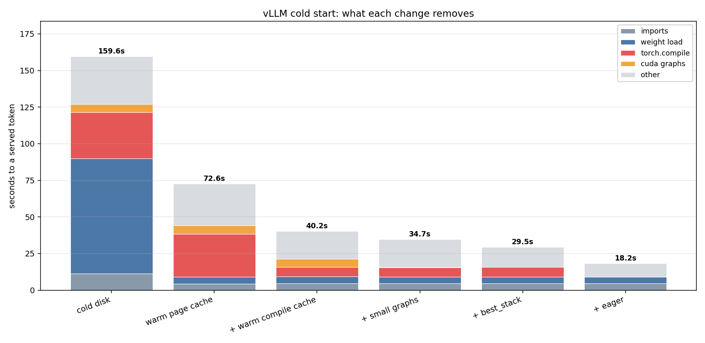

# Reducing the cold start time of an LLM server

Getting an LLM to start quicker so that it can deliver its first token as fast as possible is one of the most important problems in the LLM inference industry. This article looks at how the cold start time of an LLM served with the vLLM inference engine can be reduced.

## What is cold start

Cold start is the time from starting the server process to the moment it returns the first token. Before that moment the GPU can be sitting there doing nothing useful for you, even though it is fully occupied loading and compiling things.

If a server runs for a long time and never needs to restart, meaning its parameters never change and no new configuration is loaded, the cold start cost is easy to forgive, since it is paid only once. But if a server restarts often, because it autoscales, because it runs inside a container that gets rescheduled, because a configuration is being iterated on in development, or because it shares a GPU with something else and has to give it back, then cold start happens over and over, and it starts to matter as much as steady state speed does.

In this setup, an unmodified server took 160 seconds to go from a cold process to its first token. That is nearly three minutes where the GPU is not serving anyone.

## Experiment Setup

**Hardware.** One NVIDIA H100 80GB. Everything here is a single GPU, so there is no distributed startup cost or NCCL handshake between nodes. A multi GPU setup would add its own phase on top of everything measured here.

**Model.** `Qwen/Qwen3-14B` in bf16, about 27.5 GiB of weights.

**Engine.** vLLM 0.11.0 with transformers 4.56.2, using vLLM's own Python interface directly rather than the OpenAI compatible server, so the numbers are the engine's cost and not the API server's cost on top of it. The same experiments were also run against vLLM 0.28.0 later, and the differences are noted where they matter.

**What counts as cold start here.** Wall clock time was measured from the moment the process starts importing Python packages to the moment a single test generation returns. That last part matters. It is easy to time "the server says it is ready" and miss that a server can report ready and still fail, or still be significantly slower, on the first real request. Every run included one generation, and its time was counted in the total.

**The benchmark harness.** Each measurement is a fresh Python process, not a warm loop, so that every run has a genuinely new CUDA context, matching what a real restart looks like. Between runs, the harness waits for the GPU's memory to fully clear, and if a run leaves an orphaned process holding memory, it is killed before the next one starts. Most configurations were run three or five times, and results are reported as the mean with the standard deviation, the same way a p50 would be reported with its spread. The page cache, explained below, was only dropped for the two experiments that specifically measure disk behaviour. Dropping it everywhere would add about 75 seconds of constant disk noise on top of whatever else was being measured, and would make it impossible to see small effects.

## Where do the 160 seconds go

Here is the breakdown for the unmodified server, cold in every sense: nothing cached on disk, no compiled kernels saved from a previous run.

```
159.6s total
├──  78.6s   reading the weights off disk
├──  31.9s   torch.compile building fast GPU kernels
├──   5.7s   capturing CUDA graphs
└──  43.4s   Python imports, engine setup, everything else
```



Two things dominate, and they are two completely different kinds of cost. One is disk. One is compilation. Both of them are things that get paid once and then, if care is not taken, thrown away and paid again on the next restart.

## The first big cost: reading weights off disk

The model is 27.5 GiB. Reading that off disk, cold, took 78.6 seconds. That is measured, not estimated, and was confirmed separately with a plain `dd` read off a freshly dropped cache, which returned 432 megabytes per second, the actual ceiling of the disk rather than an inefficiency in vLLM's loader. Reading two shards of the file in parallel was also tested, to see whether that would help. It did not. Two parallel readers together got 395 megabytes per second, slightly worse than one reader alone, so the disk does not reward parallel reads here.

The fix does not touch the disk at all. Linux keeps a copy of any file it has recently read in spare RAM, called the page cache. If the same file is read again and it is still in that cache, the read comes from RAM instead of disk, and it is fast. On this machine, with 196 GiB of RAM and a 27.5 GiB model, the whole model fits in the cache with room to spare.

So before starting the server, the file is read once:

```bash
cat ~/.cache/huggingface/hub/models--Qwen--Qwen3-14B/snapshots/*/*.safetensors > /dev/null
```

That line does nothing except force Linux to load the file into RAM. The next time vLLM reads it, the same 78.6 seconds becomes 4.6 seconds. Here is the harness command for the cold case and the warm case, so the difference is visible:

```bash
# cold: drop the page cache first, then measure
sudo sh -c 'sync && echo 3 > /proc/sys/vm/drop_caches'

python3 harness/run_once.py \
  --model Qwen/Qwen3-14B \
  --out result.json \
  --do-generate \
  --clean-compile-cache
```

That gave 159.60 seconds, averaged over five runs, with a spread of about 1.7 seconds.

```bash
# warm: read the weights into page cache first, then measure the same command
cat ~/.cache/huggingface/hub/models--Qwen--Qwen3-14B/snapshots/*/*.safetensors > /dev/null

python3 harness/run_once.py \
  --model Qwen/Qwen3-14B \
  --out result.json \
  --do-generate \
  --clean-compile-cache
```

That gave 72.63 seconds. The `--clean-compile-cache` flag is still there in both commands, on purpose, to isolate the disk cost alone. The compiler cost is still fully paid in both of these runs. That is the next thing to fix.

## The second big cost: compiling the model

`torch.compile` takes the model's Python code and turns it into optimised GPU kernels. This is what makes vLLM fast once it is running, and it is also expensive to do. On this model it took 31.9 seconds, cold.

The important thing is that this work produces a real artifact on disk. vLLM writes the compiled result to `~/.cache/vllm/torch_compile_cache`, keyed by a hash of the model and the engine configuration. If that folder already has the right entry in it, the compiler does not have to redo the work. The only reason it took 31.9 seconds in the two commands above is that the folder was deliberately deleted first, with `--clean-compile-cache`, to measure the true cold cost. In normal use, that would never be done.

So the fix is simply: do not delete it. Leave the flag off.

```bash
python3 harness/run_once.py \
  --model Qwen/Qwen3-14B \
  --out result.json \
  --do-generate
```

With the page cache still warm from the previous step, and the compile cache now left alone, this gave 40.24 seconds. Compare the three numbers so far:

| configuration | time | what changed |
|---|---|---|
| cold disk, cold compile cache | 159.60s | nothing yet, this is the baseline |
| warm page cache | 72.63s | pre read the weights once |
| warm page cache and warm compile cache | 40.24s | also stopped deleting the compiled kernels |

That is a 4x improvement, and neither step changes what the model computes or how fast it runs once it is warm. Nothing is being traded away. It is simply not throwing away work already done.

## Squeezing the remaining 40 seconds

Two more changes get this down further, and this is where it gets more specific to how vLLM captures CUDA graphs.

A CUDA graph records a whole sequence of GPU operations once, so they can be replayed as a single unit later instead of being launched one at a time from Python. vLLM captures a separate graph for a range of batch sizes so it has a fast path ready no matter how many requests arrive together. By default it captures graphs for 67 different batch sizes, and capturing all of them cold takes 5.7 seconds. Most of that is unnecessary when only a handful of concurrent requests are expected.

```bash
python3 harness/run_once.py \
  --model Qwen/Qwen3-14B \
  --out result.json \
  --do-generate \
  --cuda-graph-sizes 1,2,4,8
```

Capturing only four sizes instead of 67 brought the total down to 34.74 seconds. This is worth a caveat. It is free if only small batches are ever served, but if real traffic later arrives in batches of 32 or 64, execution falls back to a slower, uncaptured path for those sizes, and that fallback was measured to cost about 11 percent of steady state throughput at batch 64. The sizes captured should match the concurrency actually served, not be minimised blindly.

Stacking three more changes together, pinning the KV cache size instead of letting vLLM measure it with a profiling pass, telling vLLM to only build the lighter "piecewise" graph instead of the full one, and running the engine in the same process instead of spawning a child process for it, brought the number to 29.48 seconds:

```bash
export VLLM_ENABLE_V1_MULTIPROCESSING=0

python3 harness/run_once.py \
  --model Qwen/Qwen3-14B \
  --out result.json \
  --do-generate \
  --kv-cache-memory-bytes 32212254720 \
  --compilation-config '{"cudagraph_mode":"PIECEWISE"}' \
  --cuda-graph-sizes 1,2,4,8
```

And dropping compilation entirely, using `--enforce-eager`, brings the number to 18.20 seconds:

```bash
export VLLM_ENABLE_V1_MULTIPROCESSING=0

python3 harness/run_once.py \
  --model Qwen/Qwen3-14B \
  --out result.json \
  --do-generate \
  --enforce-eager \
  --kv-cache-memory-bytes 32212254720
```

This last one is a real trade, not a free win. Without compilation, every token generated afterwards costs somewhere between 10 and 20 percent more time, for as long as the server stays up. It is worth it for a short lived job that starts, does a small amount of work, and exits. It is usually not worth it for a server meant to stay up and serve traffic for hours, where the steady state cost adds up to far more than the 11 seconds saved at startup.

Here is the full progression from cold start to the fastest restart measured:

| configuration | time | what changed |
|---|---|---|
| cold disk, cold compile cache | 159.60s | baseline |
| warm page cache | 72.63s | pre read the weights once |
| warm page cache and warm compile cache | 40.24s | stopped deleting the compiled kernels |
| + smaller CUDA graph capture list | 34.74s | captured 4 batch sizes instead of 67 |
| + pinned KV cache, piecewise graphs, single process | 29.48s | stacked three more changes |
| + eager execution | 18.20s | dropped compilation entirely |

## The floor, and what is actually in it

18.2 seconds is close to the floor for this model on this hardware, so it is worth asking what is actually left in it once nothing can be cut further. One run was instrumented in detail, and it breaks down like this:

| what | seconds |
|---|---|
| vLLM inspecting its own model registry | 6.5 |
| reading the weights, now from page cache | 4.5 |
| importing the vLLM package | 3.4 |
| plugin discovery and assembling the config | about 2 |
| importing torch | 1.0 |
| distributed setup, even with one GPU | about 1 |
| reserving the KV cache | about 1 |

The single biggest item is not weight loading. It is vLLM inspecting the model class to work out its capabilities, which is pure CPU work that happens before any weight is touched, and it happens even though the result is cached. None of this is GPU time. All of it is Python and CPU overhead that has nothing to do with the size of the model or the size of the GPU.

Full detail: [`results/overhead_reduction/floor_attribution.md`](https://github.com/abhijithneilabraham/inference_research/blob/main/results/overhead_reduction/floor_attribution.md).

## Two things that looked like they would help and did not

**Pinning the KV cache size to skip the memory profiling step.** vLLM normally runs a short profiling pass to work out how much GPU memory it can safely give to the KV cache. The assumption was that telling it the number directly would skip that pass. It does not. It still runs the same profiling forward pass; it only skips a small accounting step afterwards. The measured saving was 0.3 seconds. The flag is kept in the stacked configuration above because it is harmless, not because it is doing real work on its own.

**Running the engine in the same process instead of a child process.** vLLM normally spawns a separate process for the engine core, which means torch and vLLM get imported twice, once in the parent and once in the child, each with its own CUDA context. Turning that off should save one whole import and one whole context setup. Measured on its own, it did not produce a consistent number, appearing as a small win in some runs and as nothing in others, with more noise than signal. It is kept only because it is a requirement for reaching the 1.1 second engine initialisation in the fully eager configuration, not because it helps by itself.

Neither of these is a criticism of vLLM. They are a reminder that a change which sounds like it should save time needs to be measured, not assumed.

## Changing a setting without paying for any of this again

Everything above is about a full process restart. A more common situation is smaller: changing one setting on a server that is already running well. Whether that is free or expensive depends entirely on what the setting is.

Sampling settings, temperature, top_p, top_k, the maximum number of tokens, the random seed, cost nothing. They are attached to each request, not to the engine, so there is no restart at all.

Waking a sleeping engine, covered below, costs about half a second.

A restart where `max_num_seqs`, `gpu_memory_utilization`, or prefix caching changes costs about 35 to 40 seconds, the same as any warm restart, because none of those touch the compiled kernels. The compile cache is still a hit.

A restart where `max_model_len` or the KV cache dtype changes costs 74 to 84 seconds, because those change the shapes or the data types the compiled kernels were built for, so the old compiled kernels no longer match and have to be rebuilt from scratch.

| setting | cost to change | why |
|---|---|---|
| SamplingParams: temperature, top_p, top_k, max tokens, seed | 0s | attached to the request, not the engine |
| waking a sleeping engine | about 0.55s | covered below |
| `max_num_seqs` | 35 to 40s | compile cache hit |
| `gpu_memory_utilization` | 35 to 40s | compile cache hit |
| `enable_prefix_caching` | 35 to 40s | compile cache hit |
| `max_model_len` | 74 to 84s | compile cache miss, shapes change |
| `kv_cache_dtype` | 74 to 84s | compile cache miss, dtypes change |
| swapping the model itself | full reload | not measured here |

Timing alone was not treated as sufficient evidence for this distinction, because a slow run and a cache miss can look similar. vLLM prints the exact folder name it is using for the compiled cache, and that name is a hash of everything that affects the compiled result.

```
Using cache directory: .../torch_compile_cache/16d4fb725b/... for vLLM's torch.compile
```

If two runs print the same hash, they are provably sharing the same compiled kernels. If the hash changes, it is provably a miss. Every setting above was checked this way, not just by timing it. Full detail: [`results/cache_invalidation/`](https://github.com/abhijithneilabraham/inference_research/tree/main/results/cache_invalidation).

One more honest note. Even a full hit is not free. It still costs 35 to 40 seconds, because part of the compilation step, the part called Dynamo tracing, is not saved to disk at all on this version of vLLM and has to be redone on every single process start, hit or miss. Only the heavier Inductor part of compilation is actually cached. This stops being true on a newer vLLM, 0.28.0, where that tracing step is itself cached and a hit drops from about 6.5 seconds to about 0.35 seconds. That same newer version also changed which settings count as a miss, `cuda_graph_sizes` became one of them, where it used to be free, so upgrading is not purely a win without re-checking existing settings against it.

| configuration | vLLM 0.11.0 | vLLM 0.28.0 |
|---|---|---|
| cold compile | 72.63s | 73.09s |
| cache-hit restart | 40.24s | 39.22s |
| pinned KV cache, piecewise graphs, single process | 29.48s | 23.48s |
| eager execution | 18.20s | 22.12s (regressed) |

Full detail: [`results/vllm_latest/`](https://github.com/abhijithneilabraham/inference_research/tree/main/results/vllm_latest).

## The thing that beats every fix above

Everything so far reduces the cost of a restart. The best answer is often to not restart at all.

vLLM can put a running engine to sleep, which moves its weights off the GPU and frees the memory, while keeping the process, the imports, and the compiled kernels exactly as they were.

```python
llm.sleep(level=1)   # about 15 seconds, frees the GPU memory
llm.wake_up()        # about 0.55 seconds, ready again
```

Waking up is not a restart in miniature. Nothing gets re-imported, nothing gets recompiled, no new CUDA context is created. It is the same process picking its weights back up. Half a second to go from asleep to serving its next token, against 29 to 40 seconds for the fastest full restarts above.

This is the option to reach for whenever the GPU needs to be handed to something else temporarily and the same server needs to come back quickly, rather than tearing it down and paying any of the costs in this article again.

## What this means in practice

If the machine is starting completely fresh, with nothing cached anywhere, the two free wins are to read the weight file into page cache while the rest of startup is happening, and to ship a pre built compile cache instead of building one from scratch on first boot. Together those two changes alone took this example from 159.6 seconds to 40.2 seconds, with nothing given up.

If the server restarts with a stable configuration, stacking the smaller graph capture list, the pinned KV cache size, and piecewise graph mode gets to about 29.5 seconds, or about 18.2 seconds if the throughput trade of eager execution is acceptable for a short lived process.

If only a setting needs to change, checking whether it is a `SamplingParams` field first is worthwhile, because those are free. If it is an engine setting, expect a 35 to 40 second restart unless it touches shapes or dtypes, in which case expect closer to 75 to 85 seconds.

And if the process itself can stay alive, sleeping and waking it beats restarting it. Half a second beats every number in this article by a wide margin.

## Where the rest of it is

This article covers the core findings. The [top level README](https://github.com/abhijithneilabraham/inference_research) has the complete table of every configuration with its measured standard deviation, [`EXPLAINER.md`](https://github.com/abhijithneilabraham/inference_research/blob/main/EXPLAINER.md) has the same material at half the length, and the [`docker/`](https://github.com/abhijithneilabraham/inference_research/tree/main/docker) folder has the packaging work for actually deploying a pre warmed image, which is its own article's worth of detail and did not fit here.

*Every number in this article is from measured runs recorded in that repository, most of them averaged over three or five repeats with the spread reported alongside. Nothing here is estimated or rounded up to make a cleaner story.*
