# Learning inference: How to host and improve the token speed of an LLM

Inference engineering can be difficult in 2026, as there is no one step playbook yet that fully solves the best inference optimisations. Frameworks are still evolving to accommodate various model architectures, and this means this field and its optimisation steps require an understanding of GPU kernels, model configurations, architectures, ML theory and more.

In this article, I will be using a 31B parameter Gemma 4 LLM to demonstrate how to improve the TPS (tokens per second). Before starting, let us understand what TPS means.

## TPS (Tokens per Second)

TPS is about how fast the model generates tokens. The faster it can generate tokens, the faster you see the output.

Simple example. A user queries:

"What is machine learning?"

And imagine the model responds in 500 words:

"Machine learning is a subset of artificial intelligence..."

If those 500 words can be generated in as little time as possible, the user will be happy. So in this article we will focus only on increasing the TPS, which is the same thing as decreasing the time it takes to produce each token.

One more thing worth knowing before we start. There are two phases when a model answers a request. The first is reading the prompt, which is called prefill, and the second is producing the answer one token at a time, which is called decode. The time to the first token is mostly prefill, and the TPS number is mostly about decode. Everything in this article is about decode, because that is where the user spends most of their time waiting when the answer is long.


## Experiment Setup

I want to be precise about the setup, because every number in this article comes from it, and if you change any part of it the numbers will move.

**Hardware.** One NVIDIA B300 GPU. This is a Blackwell part with compute capability sm_103, roughly 275 GB of HBM memory and around 6.85 TB/s of memory bandwidth. CUDA 13, driver 580. Everything ran inside Docker with the GPU passed through. There was one GPU, so there is no tensor parallelism anywhere in this article, and the results are for a single request at a time.

**Model.** Gemma 4 with 31 billion parameters, in its instruction tuned form. I used two versions of the weights. The first is the plain BF16 checkpoint, `google/gemma-4-31B-it`, which is the model exactly as released. The second is `nvidia/Gemma-4-31B-IT-NVFP4`, which is the same model with its weights quantised to 4 bits in NVIDIA's NVFP4 format. I will explain what that means when we get there.

**Drafter.** For speculative decoding I used `google/gemma-4-31B-it-assistant`, which is a small model Google trained specifically to guess ahead for the 31B model. This is what is called an MTP drafter, and it turns out to matter more than anything else in the article, so there is a full section on it below.

**Workload.** Every request has about 10,000 input tokens and asks for about 1,500 output tokens, with temperature 0.6 and top_p 0.95. The 10k input is a realistic long document, and the 1,500 output is long enough that decode dominates the total time. I ran one request at a time, which is called concurrency 1 or single stream. This is the setting where TPS is highest and where it is easiest to see what each optimisation does.

**Engines.** I used two inference servers, vLLM and SGLang. Both are open source and both serve an OpenAI compatible API. I tried several versions of vLLM, including a release version, a nightly build and eventually my own patched build, because as you will see the stock versions could not run the configuration I wanted.

**The benchmark client.** Before touching any engine I wrote a small script that sends the 30 prompts, streams the response, and records the output speed in tokens per second along with time to first token and whether the request succeeded. It reports the median, which is called p50, because the median is what a typical user sees and it is not thrown off by one slow request. The prompts are frozen in a dataset called [longctx30](https://huggingface.co/datasets/abhijithneilabraham/longctx30) on Hugging Face, built from twelve public domain nonfiction books, with each prompt being two passages of about 5,000 tokens each followed by one of five tasks such as summarise, outline or extract facts. The script that generates it is included in the same repository, so you can rebuild it or change the books. Loading it takes two lines:

```python
from datasets import load_dataset
ds = load_dataset("abhijithneilabraham/longctx30", split="train")
```

Each row has a `prompt` and a `max_out`, which is all the benchmark client needs. If you build your own benchmark set, the two things to hold fixed across every run are the token count and the mix of tasks. The actual text matters less than you would think.

**The correctness check.** Every configuration, before I looked at its speed, was asked one greedy request: write a Python function for the nth Fibonacci number, then compute 17 times 23. If the answer was not coherent or did not say 391, I stopped there. A configuration that produces garbage quickly is worse than one that is slow, because it looks like a win, and this check caught real problems more than once.

One honest note about the dataset. The numbers in this article were measured on an earlier prompt set of exactly this shape. The longctx30 dataset on Hugging Face is the public reproduction set, with the same token budget, the same five tasks and the same two passage structure but different source text. I would expect it to land within a few percent, but I have not re-run the full set of experiments on it.

## The two ideas that do most of the work

Before the results, two concepts need explaining, because almost all of the speed comes from them.

### Speculative decoding

A normal decode step produces exactly one token. The model reads all of its weights from memory, does a forward pass, and out comes one token. For a 31B model in BF16 that is about 60 GB of weights read for every single token, and at 6.85 TB/s that read alone takes about 9 milliseconds. So even if everything else were free, you could not get much past 110 tokens per second this way.

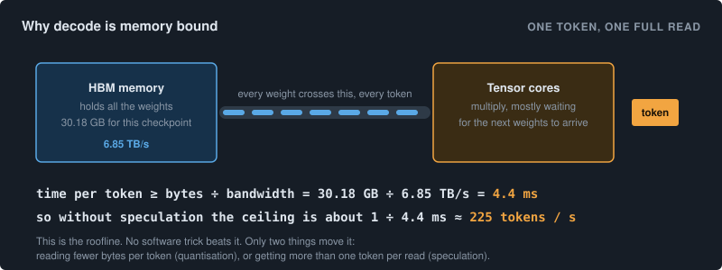

Speculative decoding changes the arithmetic. A small fast model, the drafter, guesses the next several tokens. Then the big model checks all of those guesses in one forward pass, which costs about the same as producing one token. Every guess that was correct is kept, and the first wrong one is replaced with what the big model would have said. So for one expensive forward pass you might get four or five tokens instead of one.


The important thing to understand is that this is exact. The output is the same as if the big model had generated every token itself, because the big model verifies every one. The drafter only changes how fast you get there, never what you get. The number of tokens the drafter attempts per step is called k, and the average number that get accepted is called the acceptance rate. In this article, with a good drafter, the acceptance was around 4 tokens per step.

MTP stands for multi token prediction. It is the name for the kind of drafter Google shipped for Gemma 4, where the drafter is a small set of extra layers trained alongside the main model to predict ahead. It shares the main model's KV cache, which makes it cheap to run.

### Quantisation and NVFP4

The other idea is to make the weights smaller so there is less to read. The BF16 checkpoint stores each weight in 16 bits. NVFP4 stores most of them in 4 bits, with a small scaling factor shared across groups of 16 weights. That is four times fewer bytes for the layers that are quantised, and Blackwell GPUs have tensor cores that can multiply in this format directly.

One thing that turned out to matter a lot, which I will come back to, is that not every layer in this checkpoint is quantised. Only the feed forward layers, the MLPs, are in 4 bits. The attention layers and the output head are left in BF16. That is a decision NVIDIA made when they made the checkpoint, and it has consequences for both the speed and the engineering.


## First results with the stock engines

I started by trying every combination I could with unmodified engines. Here is what that first pass looked like, measured with the setup above.

| Engine | Weights | Drafter | tok/s | What happened |
|---|---|---|---|---|
| SGLang | NVFP4 | MTP, k=6 | 139.6 | worked out of the box |
| SGLang | NVFP4 | none | 78.9 | the floor without speculation |
| SGLang | BF16 | MTP, k=6 | 122.4 | worked |
| vLLM 0.24 | BF16 | MTP, k=6 | 139.4 | worked |
| vLLM 0.24 | BF16 | none | 60.6 | the floor without speculation |
| vLLM 0.24 | NVFP4 | any | failed | `tie_weights NotImplementedError` |
| vLLM nightly | NVFP4 | none | 80.9 | loads, but no speculation |
| vLLM nightly | NVFP4 | MTP | failed | `Trtllm-gen kernels not found: headDimQk=512` |

There are two things in this table that I did not expect going in, and both of them shaped the rest of the work.

The first is that speculative decoding is doing most of the work. NVFP4 without a drafter gives about 80 tokens per second on either engine. Adding the drafter takes it to about 140. The quantisation on its own matters much less than the drafter does at concurrency 1. I had assumed the opposite.

The second is that vLLM with plain BF16 weights and the drafter was already at 139.4, which is essentially the same as SGLang with quantised weights. So the combination I wanted, NVFP4 plus MTP on vLLM, was worth chasing precisely because each half worked on its own and only the combination failed.

The other thing to take from this table is to write down the failures exactly as they appear. Those two error strings are the first and fourth of nine problems I had to solve, and having the exact text saved a lot of re-running later.

A small correction to something I nearly wrote wrong when I first summarised this work. Every SGLang run above used SGLang's Triton attention backend. I never ran SGLang with FlashInfer. So when I compare vLLM against SGLang at the end, I am comparing vLLM on a patched FlashInfer path against SGLang on Triton, and that is a fair comparison to make but it is not the same as saying both engines used the same attention library.

## Understanding the model before touching the engine

The vLLM failures were specific enough that I wanted to understand the model properly before deciding what to do. So I opened the checkpoint's configuration files rather than reading the model card, and two facts came out of that.

Gemma 4 with 31B parameters has 60 transformer layers. Fifty of them use sliding window attention, where each token only looks at the previous 1,024 tokens, with an attention head size of 256. The other ten use full global attention over the whole context, and those ten have a head size of 512. They are every sixth layer.

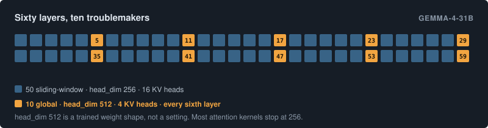

That head size of 512 is the root of almost everything that follows. Most attention kernels are written and tested for head sizes up to 256. The kernel library that vLLM picks automatically for decode on Blackwell, which is called trtllm-gen, does not have a 512 kernel at all. And this is not a setting you can lower. The size 512 is baked into the trained weights of those ten layers, because their query, key and value projections were trained to produce 512 wide heads. If you told the engine to treat them as 256 you would be reading the weights incorrectly and the output would be nonsense. The only way through is a kernel that genuinely computes attention at head size 512.


The second fact came from the quantisation config. It has a list called `exclude_modules`, and that list contains every attention module, plus the output head, plus the vision layers. So the attention is not quantised at all. Only the MLP layers are in NVFP4. The queries, keys, values and outputs of attention are all BF16.

This changed how I thought about the problem. I had been treating it as "how do I make 4 bit attention work at head size 512", which sounds like writing a new kernel. The real problem was "how do I get an existing fast kernel to accept a 512 wide BF16 head", which is a matter of routing and versions. That is a much smaller problem.

It also has a consequence for how many bytes get read per token, which is worth seeing now because it comes back at the end.


The unquantised attention weights, at 16.96 GB, are larger than the quantised MLP weights at 10.40 GB. So even with a 4 bit checkpoint, more than half of the bytes read per step are still 16 bit. Hold that thought.

## Deciding to patch the engine

At this point I had a working SGLang configuration at 139.6 and a working vLLM configuration at 139.4, and a vLLM NVFP4 configuration that would not load. The easy thing would have been to stop, and 139.6 is a perfectly respectable number.

The reason I did not stop is that both failures were specific. `tie_weights NotImplementedError` is one code path in one file. `headDimQk=512` is a kernel selection decision, not a missing kernel, because FlashInfer's own list of supported head sizes includes 512. Neither error was saying "this cannot work". They were saying "nobody has wired this up yet". That is the signal that patching is worth trying.

The signal that patching is not worth it is when the error is architectural, meaning the engine genuinely does not have the abstraction you need and you would be rewriting a subsystem. I did not hit that here, but it is the question to ask before every patch. Am I connecting two things that already exist, or am I building a thing that does not?

A few practices made the patched build manageable rather than a mess.

I patched against a pinned commit of vLLM and wrote the commit hash down in a file. Nightly builds move every day, and if your patches are against a moving target you will never be able to reproduce anything.

I wrote one patch per problem. There are seven patches in total, each one small, each one with a comment saying exactly which error it clears. When one of them stops applying after an upstream change, you know precisely what to redo.

I made the Docker build check itself. The Dockerfile upgrades FlashInfer and then runs a small test that fails the build if the head size 512 support is not present. It is much better to fail in two minutes at build time than to fail three hours later on a real request.

And I kept a fallback that is one environment variable away. Setting `VLLM_GEMMA4_512_TRITON=1` sends the ten 512 layers to a Triton kernel instead of FlashInfer. It is slower, 115.7 tokens per second instead of 150, but it is always correct. When something is broken and you need a known good configuration, having one a single flag away is worth more than the speed.

## Nine problems, in the order they appeared

What follows is every failure I hit, in order. Each one was a different error, and each fix moved strictly further than the last. There was no case where fixing a later problem also fixed an earlier one, which is what made it feel like walking through a maze rather than fixing a bug.

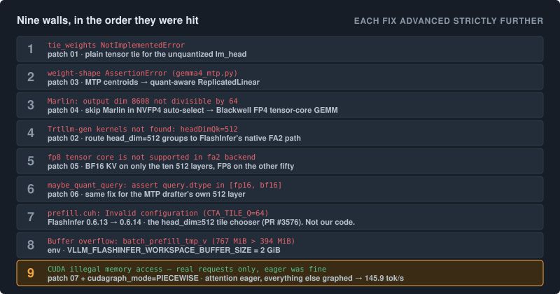

The first three are all about loading the model. The `tie_weights` error happens because the output head is excluded from quantisation and shares its weights with the embedding layer, and the quantisation code's method for tying weights raises an error on the base class. The fix is to catch that and do a plain tensor assignment, which is correct because the head is not quantised. The second error was in the drafter, where its embedding layer was an ordinary linear layer that could not accept packed 4 bit weights, and the fix was to swap it for vLLM's quantisation aware linear layer. The third was that vLLM's automatic kernel selection landed on a kernel called Marlin that needs output dimensions divisible by 64, and Gemma has a projection that is 8,608 wide, so I told the selection to skip Marlin and use the Blackwell tensor core kernel instead. None of these are interesting. All of them block you.

The fourth is the important one. On Blackwell, vLLM's FlashInfer backend chooses trtllm-gen for decode, and trtllm-gen has no kernel for head size 512. The patch adds a flag that, when it sees a head size of 512, forces FlashInfer's native path instead, which is called FA2. That patch is about twenty lines.

The fifth and sixth are the same problem twice. The FA2 kernel cannot read a KV cache stored in FP8. But only the ten 512 layers use FA2. So only those ten layers get a BF16 KV cache, using a vLLM setting called `kv_cache_dtype_skip_layers`, and the other fifty stay in FP8. Then the same thing again for the drafter, which has its own 512 layer. I think this is the most reusable trick in the whole project: choosing the cache precision per layer based on which kernel that layer needs, rather than based on accuracy.


The seventh was not in my code at all. The FlashInfer version bundled with vLLM was 0.6.13, and the fix that lets FA2 handle head size 512 arrived in 0.6.14. Without it, the code that picks the tile size returns a configuration that fails a register budget check, and you get an alarming looking `Invalid configuration` error from deep inside a CUDA file. The fix was a version bump. There was a complication, which is that there is no 0.6.14 build of the precompiled kernel package, because the 512 entry was removed to keep the package under GitHub's size limit. So you install the 0.6.14 Python package with the 0.6.13 kernel package and tell FlashInfer to ignore the version mismatch. This is safe, and it took me a while to be sure it was safe, because the 512 kernel is compiled on first use from headers in the Python package and never touches the precompiled package at all.

The eighth is a buffer size. FA2 at head size 512 needs about 767 MB of scratch space and the default is 394 MB. You set it to 2 GB and move on.

The ninth deserves its own section.

## A kernel that is correct and still crashes

After the eighth fix, the server started. The warmup ran. CUDA graph capture ran. Everything looked healthy. Then the first real request crashed with a CUDA illegal memory access.

If I started the server with `--enforce-eager`, which turns CUDA graphs off entirely, it worked perfectly. Coherent output, the Fibonacci function was correct, 17 times 23 came out as 391, all 30 benchmark requests succeeded. At 46.7 tokens per second.

So the kernel was numerically correct. It just was not safe to run inside a CUDA graph on this GPU. And the lesson that I want to underline is that warmup and graph capture use dummy data. A kernel can pass all of that and still crash on real inputs. The server starting successfully tells you nothing. Only a real request does.

This needs a short explanation of what a CUDA graph is. Normally, every operation in the model, every matrix multiply and every normalisation, is launched from Python one at a time, and the GPU sits idle for a moment between each launch. For a big model that is thousands of launches per token and the idle gaps add up to a large fraction of the step time. A CUDA graph records the whole sequence of launches once and then replays it as a single unit, which removes almost all of that overhead. It is one of the biggest single speedups in serving, which is why turning it off cost so much.

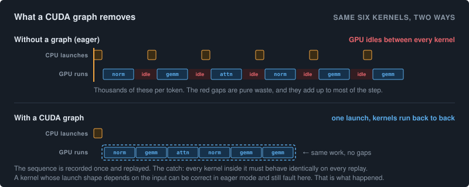


vLLM decides on one CUDA graph mode for the whole model, based on the lowest level of support reported by any of its attention groups. The seventh patch makes any group with head size 512 report that it does not support graphs, so vLLM will refuse to put it in a full graph and fail immediately at startup instead of crashing later. That is a diagnostic, not a fix.

The fix is a launch flag: `--compilation-config '{"cudagraph_mode":"PIECEWISE"}'`. In this mode, attention becomes a split point in the graph. Every attention operation runs eagerly, on the FA2 path that I had already proven correct. Everything between the attention operations, meaning the 4 bit matrix multiplies and the normalisations, which is most of the compute, stays inside CUDA graphs. The code path that was crashing is never built.

That took the speed from 46.7 to 145.9 tokens per second.

The general lesson is that comparing eager mode against graph mode is a diagnostic. If a kernel works in eager mode and crashes with graphs, you have a graph safety problem, not a maths problem, and you almost certainly do not need to touch the kernel. You need to keep that one operation out of the graph. Before this I would have assumed that an illegal memory access meant the kernel needed fixing.

Why exactly the kernel is unsafe under graphs is not fully settled. My best current understanding, from FlashInfer's own documentation and an open upstream issue with the same symptoms on a related path, is that the number of thread blocks the kernel launches depends on the length of the KV cache, and a mismatch between what was planned at capture time and what is needed at replay time causes the fault. The version that added the 512 support included tests for eager mode and none for graph capture, so I would not have expected it to work under graphs either.

There is a limitation to be honest about. vLLM only allows one graph mode for the whole model, so I cannot put the fifty 256 layers inside graphs and only run the ten 512 layers eagerly. It is all attention eager or none. Piecewise mode is the best achievable on this version of vLLM, and it was enough.

## Tuning the two remaining knobs

Once the fast path worked, two settings were left, and both are exact, meaning they change speed but never change which tokens come out.

The first is k, the number of tokens the drafter attempts per step. The drafter shipped with Gemma 4 predicts one token per internal step, so k is simply how many times to loop, and the only ceiling is 128. The second is block size, which is how the KV cache is laid out in memory in pages. It has to stay at 64 or below, because at 128 vLLM switches back to trtllm-gen and the 512 problem returns.

| k | tok/s | | block size at k=8 | tok/s |
|---|---|---|---|---|
| 5 | 141.2 | | 16 | **150.0** |
| 6 | 145.9 | | 32 | 148.2 |
| 7 | 147.9 | | 64 | 146.8 |
| 8 | **150.0** | | 128 or more | breaks, routes back to trtllm-gen |

The k curve is still rising at 8, so sweeping 10, 12 and 16 is the obvious next thing to try. But notice how small this section is. Four values of one setting and three of another. Once the structural work is done, the tuning is short.

## Are we bandwidth bound? Computing the roofline

This is the part I should have done first and did last.

At concurrency 1, decode ought to be limited by memory bandwidth. Tokens per second is roughly bandwidth divided by bytes read per token. From the bytes figure earlier, one forward pass reads about 31.4 GB including the KV cache, and at 6.85 TB/s that takes about 4.6 milliseconds. The measured time per step at k=8 was 29.7 milliseconds.


So the real system is about 6.5 times slower than the memory roofline. At 150 tokens per second the model is not limited by bandwidth at all. It is limited by overhead. Something like 85 percent of each step is spent on launching kernels, dispatching work and running the drafter, and not on reading weights.

This one number invalidates most of the tuning ideas I had written down. Changing the KV cache precision or the block size cannot close a gap of 6.5 times. Quantising the attention weights, which are 56 percent of the bytes, would cut the roofline from 4.4 milliseconds to about 2.3, but the roofline is not what is limiting us, so that would buy nothing until the overhead gap closes.

The one thing that would close the gap is running the whole model inside full CUDA graphs, which is exactly the thing the FA2 head size 512 bug prevents. So the next doubling in speed is behind that bug, not behind any further quantisation. That is a less satisfying answer than "try FP8 KV cache", but it is the true one.


SGLang also reports 159.4 tokens per second with a relaxed acceptance threshold. That setting is lossy, meaning it changes what tokens come out, and the equivalent setting does not exist in the version of vLLM I used, so it is not a fair comparison. Exact output against exact output, vLLM finished at 150.0 against SGLang's 139.6, which is 7.5 percent ahead.

## Four things I got wrong along the way

My first set of notes had a list of quick wins to try next. When I went back through the vLLM source and the FlashInfer pull requests, four of them turned out to be wrong, and I am recording them because they are the kind of wrong that sounds convincing.

I thought the drafter's forward passes were running eagerly and eating the step time. They were not. The drafter has its own CUDA graph dispatcher and piecewise mode already applies to it. And a related trap: setting `enforce_eager` inside the speculative config silently turns off the drafter's graphs entirely and ruins the k=8 result.

I thought putting the ten 512 layers back on FP8 KV cache would be a speedup. The global KV cache at 10k context is 0.82 GB in BF16, so FP8 saves 0.41 GB, which is about 0.06 milliseconds out of a 29.7 millisecond step. That is 0.2 percent.

I thought I could add a lossy acceptance threshold like SGLang's for another 14 percent. The rejection sampler in vLLM's v1 engine has exactly three modes, standard, synthetic and block, and none of them is a threshold. The synthetic mode accepts without verifying, which produces garbage rather than a quality tradeoff. SGLang's 159.4 is simply a number that cannot be reached in vLLM v1.

And I thought the 512 kernel might be untested on this GPU and that a newer FlashInfer would fix it. The pull request that added it targets all of the SM100 family, so this GPU was always in scope. The bug is about graph safety, not architecture support, and no version up to 0.6.15 changes it. Waiting would not have helped.

## If you are starting from scratch

If I compress the whole experience into what to do when the stock setup does not work, it looks like this.


Every box on the highlighted path was a different error. None of the fixes were kernel rewrites. Two were version bumps, one was a configuration mode, and the rest were short routing or precision patches. The question to ask at each step is whether the error is telling you that the thing does not exist, or that nobody has connected it yet. Almost every problem in this article was the second kind.

Three things I would do differently. Compute the roofline on the first day, because it costs an hour with the checkpoint config and a calculator and it tells you which settings are worth touching. Test eager mode against graph mode the moment anything crashes, because it is the fastest way to separate a wrong kernel from an unsafe one and those need completely different fixes. And gate every configuration on a real request before looking at throughput, because I would have reported at least one broken configuration as a win otherwise.

## Where the code is

The seven patches, the self checking Dockerfile, the correctness script and the benchmark client are all in the [benchmark_gemma](https://github.com/abhijithneilabraham/benchmark_gemma) repository. The benchmark dataset is on Hugging Face at [abhijithneilabraham/longctx30](https://huggingface.co/datasets/abhijithneilabraham/longctx30), along with the script that builds it. The full engineering log, with every error and every fix in sequence, is in [FPA4FIX.md](https://github.com/abhijithneilabraham/benchmark_gemma/blob/main/FPA4FIX.md), and the mechanism level detail, with the file and line for every change plus the roofline arithmetic, is in [TECHNICAL_DEEP_DIVE.md](https://github.com/abhijithneilabraham/benchmark_gemma/blob/main/TECHNICAL_DEEP_DIVE.md).

*Every number in this article is from the benchmark runs recorded in that repository. Nothing is estimated or extrapolated. Where a mechanism is my best current understanding rather than something confirmed, the text says so.*
