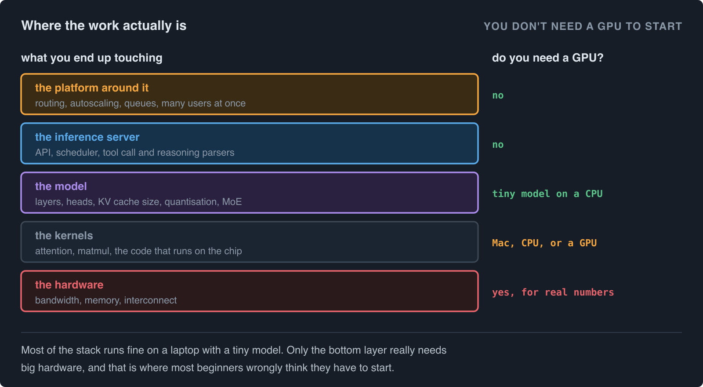
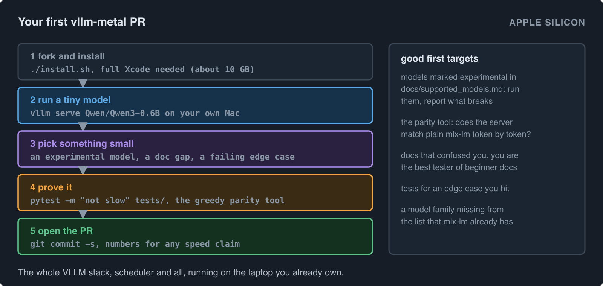
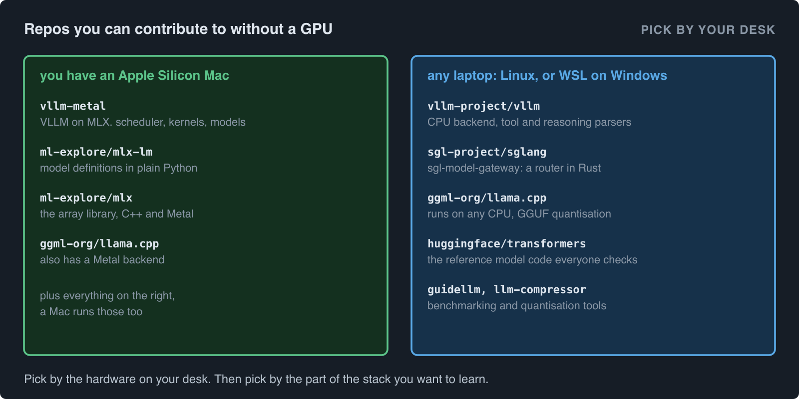
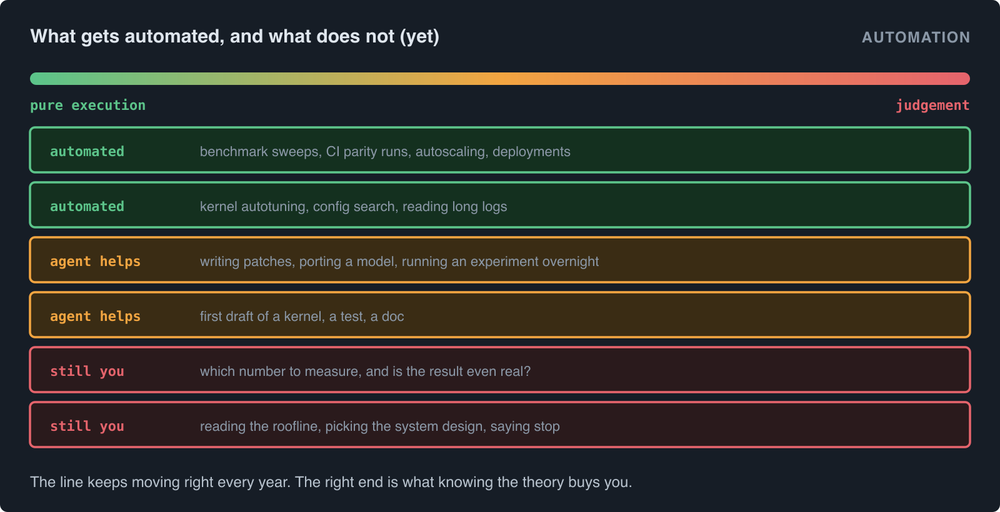
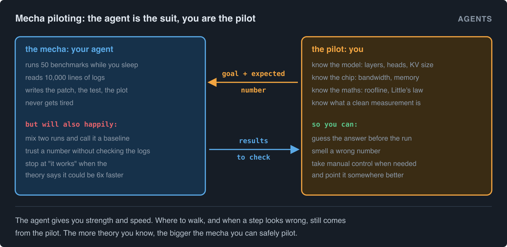

# Learning Inference: A case study for beginners

I would first like to thanks for the wonderful support and messages I have recieved for my past blogs :). If you would like to support me for writing more content, here's the link.

I have been building LLM inference in production for a while. It never stopped at just learning about GPUs, inference servers like VLLM, Sglang, etc. I had to deep dive into what each model's architecture is, their attention heads, number of layers, parameters, quantisation, MoE, and so much more. On top of that, you will also end up building the platform around the solution you built. It can be bare metal, which means you house one user, or it can be serving millions of users if you're serving infrastructure for people to use it as Agents (coding agents for millions of users for eg). Overall, you have to be dipping your feet outside your own box (pun intended about your GPU boxes) and go trading knowledge with your colleagues to understand what's the best system architecture for you to deal with.

The most common question in my messages is some version of "how do I get into inference if I don't have a GPU?". It's a fair question, because renting a single H100 for a month of learning costs more than most people want to spend. So in this blog, I will first show you that you can start contributing to real inference projects from the laptop you already have. Then I will list the repos where you can do that, for Mac users and for everyone else. And at the end, I want to talk about something I have been thinking about a lot lately, which is how much of this job is getting automated, and what part of it you can still own.

## You don't need a GPU to start

When people think about inference, they think about GPUs and CUDA kernels. That's a small part of the actual work. If you look at what gets merged into a project like VLLM in any given week, a lot of it is the scheduler, the API server, parsers for tool calls, support for new models, tests, docs, benchmarks, etc. None of that needs a GPU to write. And most of it can be tested with a tiny model like Qwen3-0.6B running on your laptop.



The only layer where you really need big hardware is when you want real performance numbers. And even there, a Mac with Apple Silicon gets you surprisingly far, which brings me to my favourite repo for beginners right now.

## Repos to contribute: if you have a Mac

### VLLM Metal

[vllm-metal](https://github.com/vllm-project/vllm-metal) is a plugin that runs VLLM on Apple Silicon using MLX. I wrote a [full beginner guide on how it works here](../vllm-metal/blog.md), so I won't repeat all of it. The short version is that it keeps VLLM's scheduler and API server as they are, and swaps out the parts that need a GPU with Metal kernels written for the Mac. So you get the whole VLLM stack, the same one people run in production on big GPU boxes, running on your laptop.

Why I like it for beginners:

- It's a real VLLM. The scheduler, the paged KV cache, prefix caching, speculative decoding, all of it is there. What you learn here carries straight over to the GPU version.
- It's a lot smaller than VLLM itself, so you can actually read the main code path in a weekend.
- The tests run with tiny models. There's also a parity tool that checks if the server gives the same tokens as plain mlx-lm, so you can prove your change works without borrowing anyone's GPU.

To set it up, fork the repo on GitHub and follow their contributing guide:

```bash
git clone https://github.com/YOUR_USERNAME/vllm-metal.git
cd vllm-metal
git remote add upstream https://github.com/vllm-project/vllm-metal.git
git switch -c my-change
./install.sh
source .venv-vllm-metal/bin/activate
uv pip install -e ".[dev]"
```

One thing to know before you start. You need the full Xcode (around 10 GB) with the macOS 26.2 SDK or newer, even if you only plan to change Python code, because the setup builds the Metal parts too. The command line tools alone won't do. Once that's done, this is the quick loop to check your changes:

```bash
scripts/lint.sh
pytest -m "not slow" tests/
```



Some good first things to pick up:

- **Experimental models.** The [supported models page](https://github.com/vllm-project/vllm-metal/blob/main/docs/supported_models.md) marks a lot of models as experimental. Run one on your Mac, and if something breaks, that's an issue (and maybe a PR) right there. The page asks you to open an issue for it, and not add new rows to the table yourself.
- **Parity.** If you change anything about how a model runs, run the [greedy parity tool](https://github.com/vllm-project/vllm-metal/blob/main/docs/tools.md) and report the `EXACT` and `TOP_K_MATCH` counts. This is what the maintainers ask for in every model PR.
- **Docs.** If something confused you during setup, you are the best person to fix it, because the people who wrote it can't see the problem anymore.
- **Speed claims** need before and after numbers from `vllm bench serve`. And sign off every commit with `git commit -s`, the repo needs it.

### mlx-lm and mlx

vllm-metal loads every model through [mlx-lm](https://github.com/ml-explore/mlx-lm). So adding a new model family to mlx-lm is also a way of getting that model into vllm-metal later. It's plain Python, roughly one file per model family, and it's one of the best places I know to understand how a model is actually built, layer by layer. If you want to go one level deeper, [mlx](https://github.com/ml-explore/mlx) is the array library underneath all of this, written in C++ and Metal. Both have a CONTRIBUTING.md in the repo.

## Repos to contribute: if you don't have a Mac

Most people I talk to are on Linux or Windows laptops, so here are the ones that work without a Mac and without a GPU.



### VLLM itself

[VLLM](https://github.com/vllm-project/vllm) has a CPU backend that runs on Intel and AMD x86, ARM, Apple silicon and IBM Z. It has its own channel (`#sig-cpu` on the VLLM Slack), and issues about it get a `[CPU Backend]` tag in the title. On Windows, you will want WSL for this.

Apart from the CPU backend, there are big parts of VLLM that don't care about hardware at all. The tool call parsers (`vllm/tool_parsers`) and reasoning parsers (`vllm/reasoning`) for eg, turn a model's raw text into proper tool calls and thinking blocks, and almost every new model family needs one. When I checked, VLLM had 21 open issues labelled good first issue.

### Sglang

[Sglang](https://github.com/sgl-project/sglang) is the other big inference server. The part I would point beginners to is `sgl-model-gateway`, the router that sits in front of many Sglang workers and decides where each request goes. It's written in Rust, it's pure systems work (load balancing, retries, cache aware routing), and it needs no GPU at all. If you read my scaling blog, this is the router box from those diagrams, in real code. Sglang also had 49 open good first issues when I checked, the most of any repo in this list.

### llama.cpp

[llama.cpp](https://github.com/ggml-org/llama.cpp) runs on basically any CPU, which is why so many people use it to run models locally. If you want to properly learn quantisation, the GGUF format, and how fast kernels are written for CPUs, this is a great place. It had 17 open good first issues at the time of writing. It also has a Metal backend, so Mac users can play here too.

### Hugging Face transformers

Almost every inference engine checks its outputs against [transformers](https://github.com/huggingface/transformers), which makes it the reference for how a model is supposed to behave. Model code, tests and docs mostly run on CPU, and they label beginner friendly issues as `Good First Issue` and `Good First Documentation Issue`.

### guidellm and llm-compressor

These two are tools from the VLLM project that sit around serving. [guidellm](https://github.com/vllm-project/guidellm) is for benchmarking a server, and [llm-compressor](https://github.com/vllm-project/llm-compressor) is for quantising models before you serve them. Benchmarking tools are especially good for beginners. To improve one, you have to understand what TTFT, throughput and latency actually mean, and once you understand those, you understand half of this job (my [scaling blog](../scaling/blog.md) goes deep into that).

### How to pick your first issue

A few things that helped me, whichever repo you pick:

- **Follow one request.** Pick one request and follow it from the API all the way down to the kernel, even if you don't understand every line. You will understand the next issue much faster.
- **Go small on the model.** Reproduce with the smallest model you can find. 0.6B models are your best friend here.
- **Test first.** Write the test that fails before you write the fix, so you know it was actually broken.
- **Keep the PR small.** A small PR that gets merged teaches you more than a big one that sits open for months.

## Automation in this industry

Now the part I have been thinking about a lot. A good chunk of this job is getting automated, and it's happening fast.

Some of it has been automated for years. Benchmark sweeps run from scripts. Autoscaling adds and removes GPUs on its own. Kernels get autotuned by trying hundreds of configs and keeping the fastest. CI runs correctness checks on every change (vllm-metal for eg, runs its parity check every day on two macOS versions without anyone touching it). And now on top of all that, coding agents write patches, port models, read ten thousand lines of logs in seconds, and run experiments overnight while you sleep. I use them every single day.

So the obvious question is, how much of this can you escape? My honest answer is that the execution part, not much. But the part where you decide what to execute, and whether to trust what comes back, is still very much yours. And that's exactly the part where knowing the architecture and the theory pays off.



## Mecha piloting

I like to think of it as piloting a mecha (if you have watched Gundam or Pacific Rim, you know what I mean). The agent is the suit. It's strong, it's fast, and it never gets tired. You are the pilot sitting inside it. The suit can take a thousand steps a minute, but it doesn't know which way to walk, and it won't always tell you when a step looked wrong.

Two things from my own work made this very real for me.

When I was benchmarking cold starts for VLLM, an agent came back with a "corrected baseline" that looked like a nice fix. It was actually two different sessions mixed together. It only got caught because someone checked where each number came from, run by run, which is boring work that the agent did not think to do on its own.

In my Gemma blog, I got the model to 150 tokens per second. An agent would have happily stopped there, because it works and it's a lot faster than where we started. But a simple roofline calculation said 150 was still 6.5 times slower than what the memory bandwidth allows. That one calculation told me there was a lot more speed left, and where to look for it. No amount of running benchmarks faster would have told me that.



So what does the pilot actually need to know? From what I have seen, it's these:

- **The model.** Number of layers, attention heads, KV heads, head size, MoE or not. With just these you can work out how big the KV cache gets, and how many users fit on a GPU.
- **The chip.** Memory size, memory bandwidth, how the GPUs talk to each other. This tells you the best number you can ever hope for.
- **The maths.** The roofline, Little's law, the KV cache formula. None of it is hard, but it lets you guess the answer before you run anything.
- **What a clean measurement looks like.** Fresh processes, cleared caches, the same prompts every time, and checking the raw logs over the dashboard.
- **The system.** Where the router goes, what autoscales, what fails first when traffic spikes.

Most days, I pilot. I give the agent a goal and a number I expect from the theory, it does the heavy lifting, and I check what comes back against what I expected. When the two don't match, that's the interesting part, and sometimes that means getting out of the suit and doing it by hand, reading the kernel, or running the one command myself. Either way, you still need to know what to do. The agent makes you faster at doing it, and the theory is what tells you what it is.

## Overall

If you are starting out, don't wait for a GPU. Pick a repo from this list that matches the laptop on your desk, follow one request through the code, and send a small PR. And while you are at it, learn the theory behind what you are touching, the model architecture, the memory maths, the system around it. The tools will keep getting better at doing the work. Knowing what the work should be, and when a result looks wrong, is the part that stays yours, and it's also the most fun part of this job.

Thanks again for reading, and do send me a message if you end up making your first PR from this :).
