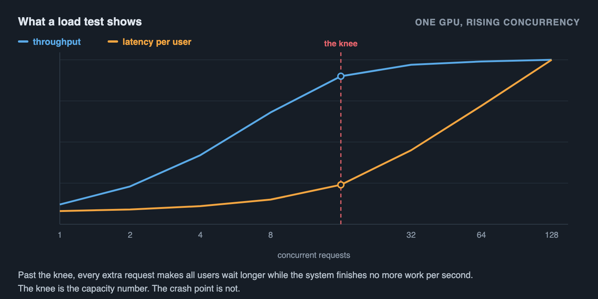
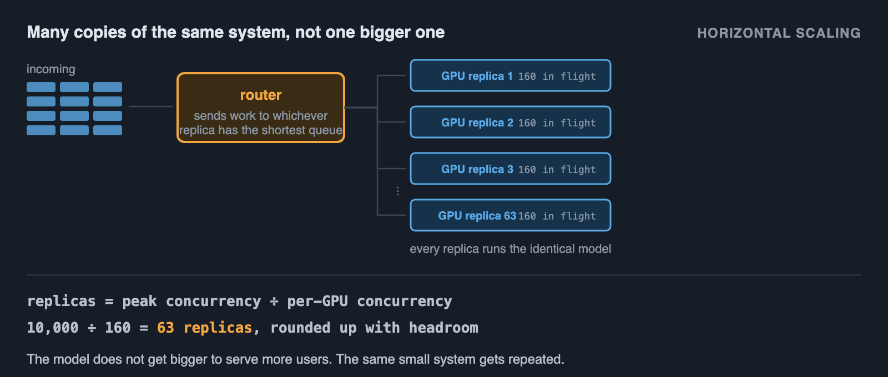
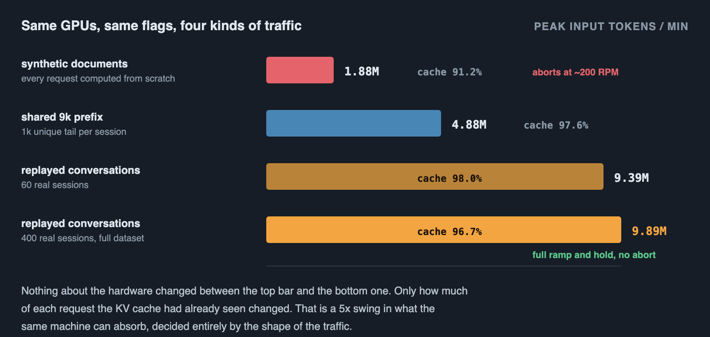
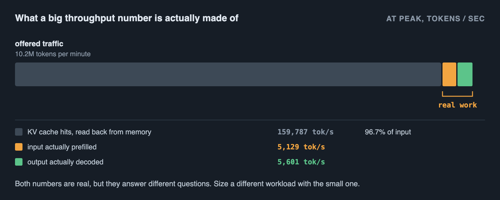

# From one GPU to millions of users

Serving a model to one user is easy. Serving it to millions is a different problem, but not a different kind of problem. It is the same problem, solved once on one GPU, then repeated. Almost all of the difficulty in inference system design comes from skipping the first step: nobody knows the real number for how many users one GPU can serve, so nobody can compute how many GPUs the whole system needs.

This article starts with the load test, because that is where the one real number comes from. Then it shows how to size a single GPU for a target number of users. Then it shows how that same number scales up to millions of customers on the same frontier model, without changing the model at all.

## Start with a load test, not a design

Before picking a GPU count, a batch size, or an autoscaling rule, there is one number that matters more than any other: how many users can a single instance of this model serve before it falls over. Guessing that number, or copying it from someone else's blog post, is how systems get built that either waste money running mostly idle or fall over on the first real traffic spike.

The only way to get that number honestly is to send traffic at the model and watch what happens. That is a load test.

## What a load test actually is

Send one request, time it, that tells you almost nothing. Send a hundred requests at once and see what happens, that tells you everything.

A load test increases the number of requests running at the same time, called concurrency, in steps: 1, then 2, then 4, then 8, and so on. At each step it records two numbers: throughput, which is completed requests per second, and latency, which is how long each individual user waits for their answer.

Plot latency against concurrency and a shape appears every time. At low concurrency, latency stays flat and low, because the GPU has spare capacity and every request runs mostly on its own. Then there is a bend, called the knee, where latency starts climbing while throughput barely improves anymore. Past the knee, adding more concurrent requests makes every single user wait longer without the system finishing any more work per second.

The knee, not the crash point, is the number that matters. A system pushed past the knee does not fail cleanly. It gets slower and slower for everyone until it looks broken, long before it actually stops responding.



## The rule that connects concurrency, throughput and latency

There is a simple relationship, called Little's Law, that connects the three numbers a load test measures:

```
concurrency = throughput × latency
```

The number of requests being worked on at any moment equals how many finish per second, multiplied by how long each one takes.

Suppose a load test shows throughput levels off at 20 requests per second once average latency reaches 2 seconds. Concurrency at that point is 20 × 2 = 40. That is roughly how many requests the system can hold in flight before it is at the knee. Past that, latency keeps climbing but throughput stays near 20, because the GPU is already doing as much work as it can.

This one formula is the whole tool. Everything else in this article is either measuring the two numbers that go into it, or using the concurrency it produces to plan capacity.


## What actually limits concurrency on one GPU

For a language model, the answer is usually not raw compute. It is memory, specifically the KV cache.

Every request being processed needs its own slice of GPU memory to hold the attention state for every token it has generated so far, called the KV cache. The size of one request's KV cache is:

```
2 × layers × kv_heads × head_dim × context_length × bytes_per_value
```

The 2 is for the K and V tensors. Longer conversations and larger models need bigger slices per request, and there is a hard ceiling: the GPU's total memory, minus what the model weights already take up, minus some overhead, divided by the size of one request's KV cache, gives the maximum number of requests that can be held in flight at once, no matter how fast the compute is.

As a worked example, not a claim about any specific measured system: an 80 GB GPU running a model whose weights take 15 GB leaves about 60 GB for KV cache and working memory. If one request's KV cache at a typical conversation length works out to around 300 MB, that GPU has room for roughly 60,000 MB ÷ 300 MB, about 200 concurrent requests, before it runs out of memory rather than compute. This is why increasing context length or switching to a bigger model can shrink concurrency sharply even when the GPU itself has not changed.


## Building a system for X users on one GPU

Put the two ideas together. Run the load test. Find the concurrency at the knee with Little's Law. Check that number against the KV cache ceiling, since whichever one is smaller is the real limit.

Pick a target latency, the slowest response time acceptable to users, and read off the load test where that latency is first reached. That concurrency, at that latency, is the honest answer to "how many users can this GPU serve."

Then leave headroom. Design for about 70 to 80 percent of the measured ceiling, not 100 percent. Real traffic arrives in bursts, not as a smooth line, and a system running at its exact measured limit has no room to absorb a burst without crossing the knee.

## What breaks first as you push past that number

Past the knee, requests arrive faster than the GPU can finish them, so they start queueing. The queue does not shrink back down on its own once it starts growing, because the system is still receiving new requests faster than it clears old ones. Latency keeps rising, timeouts start happening, and from the outside this looks identical to an outage even though the GPU is still running and still making progress. This is the actual failure mode to design against, not a crash.

## Scaling to millions of customers

Millions of registered users almost never mean millions of concurrent requests. Most of those users are not sending a request at any given moment. The number that matters for capacity is peak concurrency, the most requests ever in flight at the same time, not the size of the customer base.

Little's Law works in this direction too. If each active user's session involves one request that takes 2 seconds, and the product sees 5,000 requests per second at its busiest moment, peak concurrency is 5,000 × 2 = 10,000 requests in flight. Millions of customers and ten thousand peak concurrent requests are completely different sizing problems, and the second one is what a system actually has to be built for. Getting this number right, from real usage data or a conservative worst case, matters more than any other decision in the whole design.


## The design: many copies of the small system, not one big one

Once peak concurrency is known, and the per-GPU concurrency ceiling from the load test is known, the number of GPU replicas needed is just:

```
replicas = peak concurrency ÷ per-GPU concurrency (with headroom)
```

If peak concurrency is 10,000 and one GPU handles 160 concurrent requests comfortably, that is roughly 63 replicas, rounded up with margin.

This is why large inference systems scale horizontally, many copies of the same model behind a router, rather than by making one enormous GPU cluster answer every request together. The model does not get bigger to serve more users. The same small system gets repeated.



## The pieces that make many replicas behave like one system

**A router that knows the state of each replica.** Spreading requests round robin across replicas ignores that some of them are already near their knee and others are idle. Routing based on each replica's current queue length keeps every replica closer to its own optimal concurrency instead of some being overloaded while others sit idle.

**Autoscaling on queue depth or latency, not CPU.** A GPU running inference can show low CPU usage while it is completely saturated on GPU memory and compute. Scaling rules built around CPU usage will not react to the thing that is actually happening.

**Continuous batching on every replica.** This is what makes one GPU able to serve many concurrent users economically instead of one at a time. Requests that arrive close together get processed as one batch on the GPU, sharing the cost of reading the model's weights across all of them, which is why concurrency past 1 is so much cheaper per request than concurrency at 1.

**Prefix caching for shared context.** When many requests share a common system prompt or repeated context, caching that shared portion once instead of recomputing it for every request cuts the work each request needs, and raises the effective concurrency ceiling for free. How large that effect can be is worth seeing in a real system, below.

**A queue with backpressure, not unbounded fan-out.** Past the ceiling, a system should reject or delay new requests deliberately, rather than accepting everything and letting every replica's queue grow until every user times out. A controlled slowdown for a fraction of users is a better failure mode than an uncontrolled one for all of them.

**Multi-region placement.** This is mainly about latency, serving users from a location close to them, and about resilience, surviving one region having a problem. Extra regions add capacity too, but that should not be the main reason for adding them.

## A real example

Everything above shows up in a real deployment: a public load test of DeepSeek-V4-Flash-0731, a large mixture-of-experts model, on one node of 8 NVIDIA B300 GPUs running vLLM.

The test itself was exactly the shape described earlier: 10k-token inputs, ramped from 50 to 2,000 requests per minute over 10 minutes, held for 5 minutes, set to abort if p95 time-to-first-token passed 4 seconds or errors passed 10%. It completed the full ramp and hold without tripping either limit.

Little's Law shows up directly in the raw numbers, not just as a teaching formula. Near the end of the run, about 1,119 requests per minute were completing, about 18.65 per second, each taking around 10 seconds end to end. 18.65 × 10 is about 186, and the harness was independently tracking around 190 to 196 requests actually running at once, the small gap being a handful of requests briefly queued rather than running.

Memory was the ceiling, not compute, here too. Split across 8 GPUs, the model's KV cache alone reserved about 214 GiB per GPU rank, before counting the model's own weights.

Workload shape decided the outcome more than the hardware did. The same server, same GPUs, same flags were tested against three different kinds of traffic. Synthetic sessions, each with a unique 10,000-token document that had to be computed from scratch every time, started struggling around 200 requests per minute. Replayed real user conversations, where later messages in a thread share most of their tokens with earlier ones, took the identical hardware to nearly 10 million tokens per minute of offered load without aborting. Nothing about the GPUs changed between these two results, only how much of each request the KV cache had already seen.



That also means the headline number needs a second look before it is trusted. At peak, the system was offered about 10.2 million tokens per minute, but 97% of that was input, and 96.7% of the input was a cache hit rather than newly computed. The actual compute, real prefill plus real decode, was closer to 10,700 tokens per second. Both numbers are genuine, but they answer different questions: the first is how much traffic this exact workload shape can absorb, the second is how much work the GPUs are doing, and only the second one transfers to a workload with a different amount of shared prefix.



Every script and every raw result: [deepseek-v4-flash](https://github.com/abhijithneilabraham/deepseek-v4-flash).

## Putting the whole thing together

The whole discipline comes down to a loop. Load test one instance to find where latency breaks down. Use Little's Law to turn that into a concurrency ceiling, checked against the KV cache math. Turn the real user base into a peak concurrency number, not a customer count. Divide to get a replica count, with headroom. Put those replicas behind a router and an autoscaler that react to queue depth, with continuous batching and prefix caching to make each replica cheap, and backpressure so the system degrades on purpose instead of by accident.

Nothing about serving millions of customers requires a fundamentally different design than serving forty. It requires doing the same arithmetic at a different scale, and building the automation, routing, autoscaling, batching, that makes running many replicas as easy as running one.
