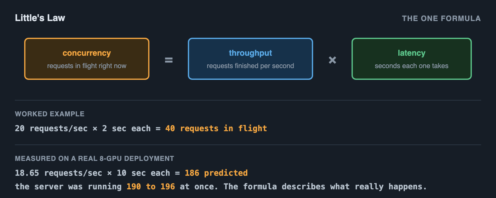
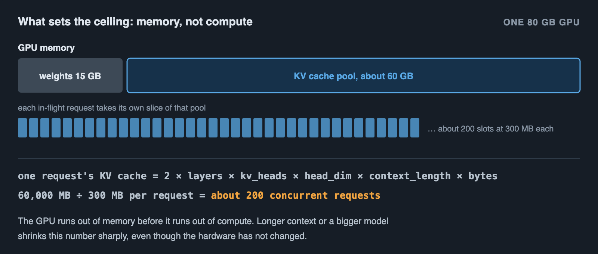
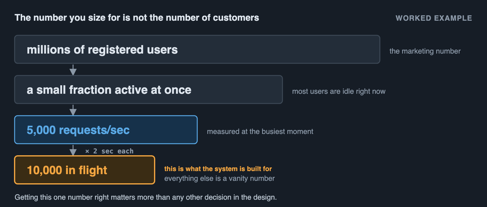
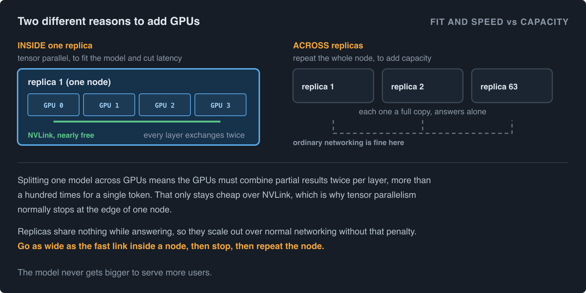
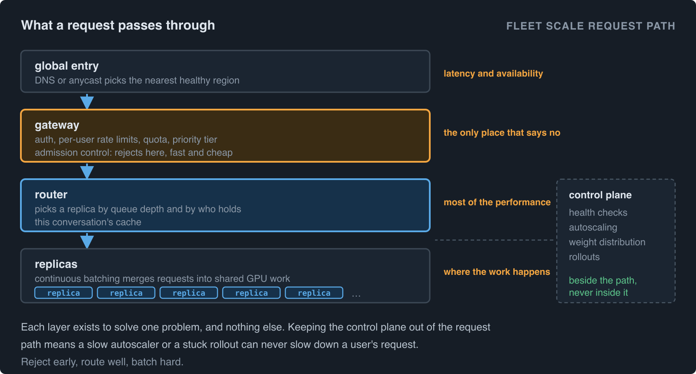
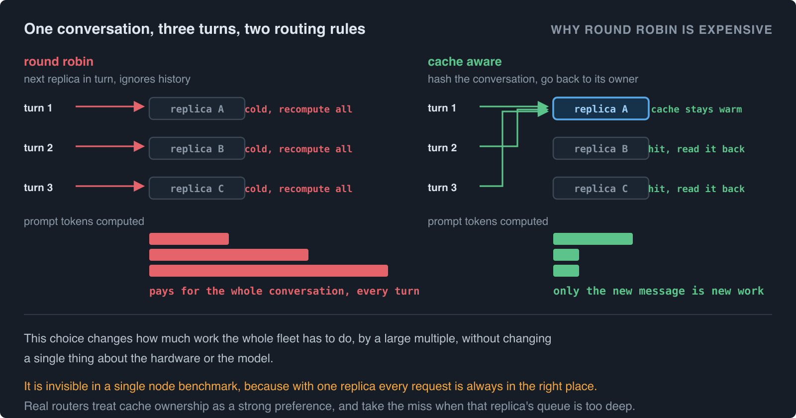
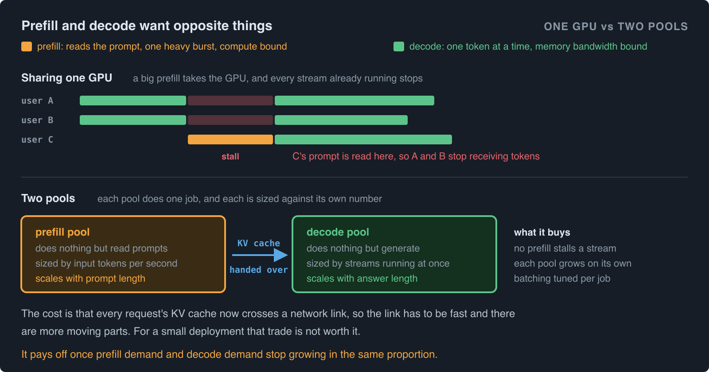
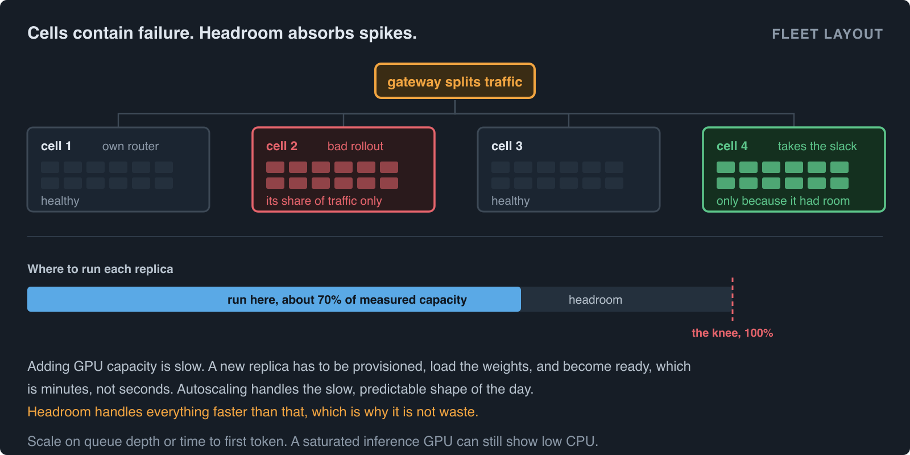
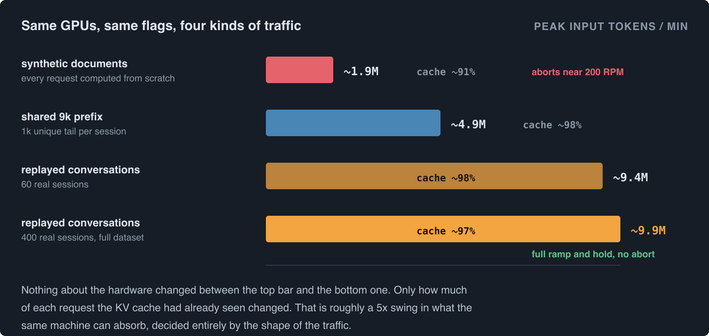
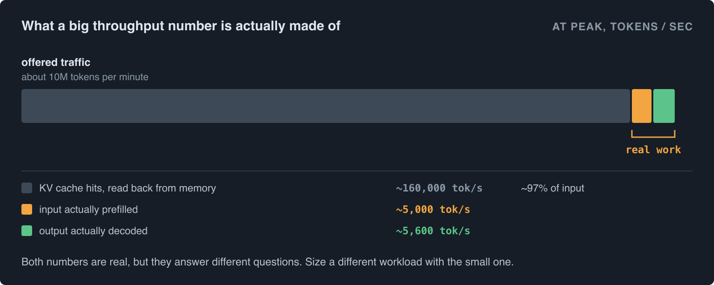

# From one GPU to millions of users

Serving a model to one user is easy. Serving it to millions is a different problem, but not a different kind of problem. It is the same problem, solved once on one GPU, then repeated. Almost all of the difficulty in inference system design comes from skipping the first step: nobody knows the real number for how many users one GPU can serve, so nobody can compute how many GPUs the whole system needs.

This article starts with the load test, because that is where the one real number comes from. Then it shows how to size a single GPU for a target number of users. Then it shows how that same number scales up to millions of customers on the same frontier model, without changing the model at all.

## Start with a load test, not a design

Before picking a GPU count, a batch size, or an autoscaling rule, there is one number that matters more than any other: how many users can a single instance of this model serve before it falls over. Guessing that number, or copying it from someone else's blog post, is how systems get built that either waste money running mostly idle or fall over on the first real traffic spike.

The only way to get that number honestly is to send traffic at the model and watch what happens. That is a load test.

## What a load test actually is

Send one request, time it, that tells you almost nothing. Send a hundred requests at once and see what happens, that tells you everything.

A load test increases the number of requests running at the same time, called concurrency, in steps: 1, then 2, then 4, then 8, and so on. At each step it records two numbers: throughput, which is completed requests per second, and latency, which is how long each individual user waits for their answer.

Plot latency against concurrency and a shape appears every time. At low concurrency, latency stays flat and low, because the GPU has spare capacity and every request runs mostly on its own. Then there is a bend, called the knee, where latency starts climbing while throughput barely improves anymore. Past the knee, adding more concurrent requests makes every single user wait longer without the system finishing any more work per second.

The knee, not the crash point, is the number that matters. A system pushed past the knee does not fail cleanly. It gets slower and slower for everyone until it looks broken, long before it actually stops responding.


## Experiment Setup

Every measured number in this article comes from one load test, described here so the numbers can be read in context. Where the article works through arithmetic to explain an idea, that is labelled as an example rather than a measurement.

**Hardware.** A single node with 8 NVIDIA B300 SXM6 GPUs, 275 GB of memory each, attached to a host with 256 CPU cores and 3 TB of RAM. One node, no cross-node networking involved.

**Model and engine.** DeepSeek-V4-Flash-0731, a large mixture-of-experts model, 167 GB of weights, served with vLLM 0.25.0 across all 8 GPUs using tensor parallelism. The KV cache was set to fp8 with a block size of 256, expert parallelism enabled, and speculative decoding on. That configuration left about 214 GiB of KV cache per GPU rank.

**The traffic corpus.** This is the part that decides the result, so it is worth stating carefully. The load was 400 multi-turn chat sessions, 1,904 requests in total, replayed turn by turn in their original order, with prompt lengths between 8,009 and 11,623 tokens and a median of 8,818. The property that matters is that each later turn in a session repeats most of the tokens of the turns before it, the way a real conversation does, rather than arriving as an unrelated block of text. For comparison, the same rig was also tested against fully synthetic unique documents, where nothing is ever shared, and against an artificial fixed shared prefix. To build a corpus of this shape, take a public multi-turn chat set such as [WildChat-1M](https://huggingface.co/datasets/allenai/WildChat-1M) or [LMSYS-Chat-1M](https://huggingface.co/datasets/lmsys/lmsys-chat-1m), keep the sessions with at least three turns, and pad the opening turn with long-form public text until prompts land in the 8k to 12k token range. Only two things need to match for the results to transfer: the prompt length and how much of each prompt is a repeat of the previous turn in the same session. The actual wording matters far less than either.

**Pinned output length.** Every request was sent with the minimum and maximum output length both set to 300 tokens. Without pinning, some requests stop early and others run long, and the decode work per request stops being comparable across steps in the ramp.

**The ramp.** Offered load climbed from 50 to 2,000 requests per minute over 10 minutes, then held at the top for 5 minutes. Each session issues about 10 requests per minute, so the session count tracks the target rate, from 5 sessions at the bottom to 200 at the top. Session start times were staggered so a ramp step does not fire a wave of cold prefills all at once, which would produce a latency spike that has nothing to do with capacity.

**What was measured.** Input and output tokens per minute, achieved requests per minute, time to first token at p50 and p95, error rate, the number of requests running and waiting at each moment, and cache hit rate. The cache hit rate was read from the server's own metrics endpoint, as the change in cached prompt tokens divided by the change in total prompt tokens, because this build does not report cached tokens per request.

**Abort conditions.** The run was set to stop itself if p95 time to first token went past 4 seconds or errors went past 10%, evaluated continuously on a rolling 45 second window. A load test without an abort rule does not produce a capacity number, it produces a slow motion outage. The abort threshold is the definition of what counts as still working.

## The rule that connects concurrency, throughput and latency

There is a simple relationship, called Little's Law, that connects the three numbers a load test measures:

```
concurrency = throughput × latency
```

The number of requests being worked on at any moment equals how many finish per second, multiplied by how long each one takes.

Suppose a load test shows throughput levels off at 20 requests per second once average latency reaches 2 seconds. Concurrency at that point is 20 × 2 = 40. That is roughly how many requests the system can hold in flight before it is at the knee. Past that, latency keeps climbing but throughput stays near 20, because the GPU is already doing as much work as it can.

This one formula is the whole tool. Everything else in this article is either measuring the two numbers that go into it, or using the concurrency it produces to plan capacity.



## What actually limits concurrency on one GPU

For a language model, the answer is usually not raw compute. It is memory, specifically the KV cache.

Every request being processed needs its own slice of GPU memory to hold the attention state for every token it has generated so far, called the KV cache. The size of one request's KV cache is:

```
2 × layers × kv_heads × head_dim × context_length × bytes_per_value
```

The 2 is for the K and V tensors. Longer conversations and larger models need bigger slices per request, and there is a hard ceiling: the GPU's total memory, minus what the model weights already take up, minus some overhead, divided by the size of one request's KV cache, gives the maximum number of requests that can be held in flight at once, no matter how fast the compute is.

As a worked example, not a claim about any specific measured system: an 80 GB GPU running a model whose weights take 15 GB leaves about 60 GB for KV cache and working memory. If one request's KV cache at a typical conversation length works out to around 300 MB, that GPU has room for roughly 60,000 MB ÷ 300 MB, about 200 concurrent requests, before it runs out of memory rather than compute. This is why increasing context length or switching to a bigger model can shrink concurrency sharply even when the GPU itself has not changed.



## Building a system for X users on one GPU

Put the two ideas together. Run the load test. Find the concurrency at the knee with Little's Law. Check that number against the KV cache ceiling, since whichever one is smaller is the real limit.

Pick a target latency, the slowest response time acceptable to users, and read off the load test where that latency is first reached. That concurrency, at that latency, is the honest answer to "how many users can this GPU serve."

Then leave headroom. Design for about 70 to 80 percent of the measured ceiling, not 100 percent. Real traffic arrives in bursts, not as a smooth line, and a system running at its exact measured limit has no room to absorb a burst without crossing the knee.

## What breaks first as you push past that number

Past the knee, requests arrive faster than the GPU can finish them, so they start queueing. The queue does not shrink back down on its own once it starts growing, because the system is still receiving new requests faster than it clears old ones. Latency keeps rising, timeouts start happening, and from the outside this looks identical to an outage even though the GPU is still running and still making progress. This is the actual failure mode to design against, not a crash.

## Scaling to millions of customers

Millions of registered users almost never mean millions of concurrent requests. Most of those users are not sending a request at any given moment. The number that matters for capacity is peak concurrency, the most requests ever in flight at the same time, not the size of the customer base.

Little's Law works in this direction too. If each active user's session involves one request that takes 2 seconds, and the product sees 5,000 requests per second at its busiest moment, peak concurrency is 5,000 × 2 = 10,000 requests in flight. Millions of customers and ten thousand peak concurrent requests are completely different sizing problems, and the second one is what a system actually has to be built for. Getting this number right, from real usage data or a conservative worst case, matters more than any other decision in the whole design.



## The unit of scaling is a replica, not a GPU

The first thing to get straight is what actually gets duplicated when the system grows.

A replica is one complete, independent copy of the model, together with however many GPUs that copy needs. For a small model that is one GPU. For a frontier model that does not fit in one GPU's memory, a replica is a whole node of 8 GPUs working as a single server. Either way, the replica is the smallest thing that can answer a request on its own, and it is the unit that gets repeated.

This matters because there are two completely different reasons to add GPUs, and they are easy to confuse.

**Adding GPUs inside a replica** is called tensor parallelism. The model's weight matrices are cut into pieces and spread across the GPUs, so every GPU holds a slice of every layer and they all work on the same token at the same time. This is done to make the model fit, and to make a single request faster. It has a cost: after every layer the GPUs must exchange and combine their partial results, twice per layer, and a model with 60 layers does that more than a hundred times for every single token. Those exchanges only stay cheap over a very fast link. Inside one node, GPUs are connected by NVLink and the exchange is nearly free. Between nodes, even on good networking, the link is roughly an order of magnitude slower, and every token pays that penalty. This is why tensor parallelism normally stops at the edge of one node.

**Adding more replicas** is how capacity grows. Each replica is a full copy and needs to talk to no other replica to answer a request, so replicas scale out over ordinary networking without any of that penalty.

So the shape of the answer is fixed: go as wide as the fast interconnect inside a node, then stop, then repeat the node.



```
replicas = peak concurrency ÷ per-replica concurrency (with headroom)
```

If peak concurrency is 10,000 and one replica holds 160 concurrent requests comfortably, that is about 63 replicas, rounded up with margin. This is why serving millions of users does not require a bigger model or one enormous cluster answering every request together. The model stays exactly the same size. The same small system gets repeated, and the interesting engineering moves to what sits in front of the copies.


## What a request passes through on the way in

At fleet scale the path from a user to a GPU has a few distinct layers, and each one exists to solve a different problem.

**Global entry.** DNS or anycast sends the user to the nearest healthy region. This is a latency and availability decision, made before anything knows what the request contains.

**The gateway.** Authentication, per-user rate limits, quota and priority tier, and admission control. This layer is where the system says no. It is cheap, stateless, and it protects everything behind it, so it should be the only place that has to make that decision.

**The router.** Picks which replica answers. This is the layer that decides most of the system's real performance, and it gets its own section below.

**The replica.** Runs continuous batching, holding many requests in flight and merging them into shared GPU work. This is what makes one replica serve hundreds of users economically rather than one at a time. Requests running together share the cost of reading the model's weights, which is why the per-request cost at concurrency 100 is a small fraction of the cost at concurrency 1.

**The control plane.** Health checks, autoscaling, weight distribution and rollouts. It sits beside the request path rather than in it, so a slow control plane never slows down a user's request.



## Routing decides most of the performance

The obvious way to spread work across replicas is round robin, one request each in turn. For inference this is close to the worst option, for two separate reasons.

The first is load. Replicas do not finish requests at the same rate, because a request generating 2,000 tokens occupies a slot far longer than one generating 50. Round robin keeps handing work to replicas that are already deep past their knee while others sit idle. Routing on each replica's current queue depth, sending the next request to whoever has the least work in flight, keeps every replica near its own best operating point instead.

The second reason is the cache, and it is the bigger one. When a user sends the next message in a conversation, almost all of that prompt is text the model already processed on the previous turn. If the request lands on the replica that handled the previous turn, that work is already sitting in that replica's KV cache and is read back instead of recomputed. If it lands anywhere else, the cache is cold and the full prompt is computed from scratch.

That single routing choice changes the amount of work the fleet has to do by a large multiple, and it does not show up in any single node benchmark, because with one replica every request is always in the right place.

So a real router tries to do two things that pull against each other. It wants to send a conversation back to the replica that already holds its cache, usually by hashing the conversation id or the prompt's prefix so the same key consistently maps to the same replica. It also wants to avoid overloading whichever replica happens to own a popular conversation. The usual resolution is to treat cache ownership as a strong preference rather than a rule: send the request to the replica holding the cache, unless that replica's queue is already above a threshold, in which case take the cache miss and go somewhere idle. Cache aware routing of this kind is built into the SGLang and vLLM production routers and into NVIDIA Dynamo.



## Splitting prefill from decode

Inside a replica, a request has two phases that want opposite things from the hardware.

**Prefill** is reading the prompt. All of its tokens are processed at once, so it is a short, heavy burst of arithmetic that saturates the GPU's compute. A 10,000 token prompt is a lot of work arriving in one lump.

**Decode** is generating the answer, one token at a time. Each step does very little arithmetic but must read the entire model's weights from memory to produce one token, so it is limited by memory bandwidth, not compute, and it runs for as long as the answer is long.

Put both on the same GPU and they interfere. A large prefill arriving mid-stream takes the GPU for itself, and every user currently receiving tokens stalls until it finishes. That shows up as a time to first token spike for the new request and a stutter in output speed for everyone else. Tuning one of those numbers pushes the other one the wrong way.

Disaggregated serving separates them. One pool of GPUs does nothing but prefill, another pool does nothing but decode, and when prefill finishes it hands the computed KV cache over the fast interconnect to a decode worker, which streams the answer. The two pools are then sized independently: the prefill pool against input tokens per second, the decode pool against the number of streams being generated at once. Each pool is also tuned for what it actually does, since the batching strategy that suits a compute bound burst is not the one that suits a steady memory bound stream.

The cost is that the KV cache for every request now crosses a network link, which needs to be fast, and the system has more moving parts. For a small deployment that tradeoff is not worth it. At fleet scale, where prefill and decode demand rarely grow in the same proportion, it usually is.



## Making the cache outlive a single replica

Prefix caching only helps while the cached tokens are still somewhere useful. In a single replica, the KV cache lives in GPU memory, which is the scarcest memory in the system, so old entries are evicted quickly to make room for active requests. A user who comes back after ten minutes finds nothing left.

Larger systems treat the cache as a tiered store rather than as something that lives and dies in GPU memory. The hot tier stays in GPU memory. Entries pushed out of it move to host RAM, which is far larger and still fast to read back. Beyond that they can go to local NVMe. Some designs go one step further and pool that memory across the whole cluster, so a cached prefix written by one replica can be read back by any other.

That last step quietly removes the routing tension described earlier. If any replica can fetch a cached prefix, affinity stops being a correctness concern and becomes a pure optimisation. This is the central idea in KV cache centric designs such as Mooncake.

## Cells, headroom and blast radius

A fleet of hundreds of replicas is not run as one flat pool. One router tracking every replica becomes both a bottleneck and a single point of failure, and one bad model rollout reaching every replica at once is an outage for everybody.

The usual answer is to group replicas into cells. A cell is a self contained copy of the whole pattern: its own router, its own set of replicas, its own autoscaler, sized to some manageable number. Traffic is divided across cells at the gateway. A cell that breaks takes out its own share of traffic and nothing else, and a new model version is rolled out one cell at a time, with the option to stop after the first one.

Two more numbers matter at this level.

**Headroom.** Replicas should not be sized to sit exactly at the knee, because the knee is where things stop degrading gracefully. Running at around 70% of measured capacity leaves room to absorb a spike without latency moving. That spare capacity is not waste, it is the thing that makes the system feel stable.

**Failure capacity.** If losing a cell is survivable, the fleet needs enough spare capacity to absorb that cell's traffic. Sizing for exactly peak demand means the first failure becomes an outage, because the remaining cells were already full.

Headroom matters more than it does for a stateless web service, because adding GPU capacity is slow. A new replica has to be provisioned, then load the model's weights, then be ready before it takes traffic, and that is minutes, not seconds. Autoscaling handles the slow, predictable shape of the day. Headroom handles everything faster than that.

For the same reason, autoscaling has to watch the right signal. A GPU running flat out on inference can show low CPU usage, so a scaling rule written around CPU will not react at all. Queue depth, time to first token, or the number of requests waiting are the signals that actually move when the system is in trouble.



## Saying no on purpose

Every system has a ceiling, and traffic does not agree to stay under it. The only real choice is whether the system fails deliberately or accidentally.

Accidental failure is accepting everything. Queues grow at every replica, latency climbs for every user, requests start timing out, clients retry, the retries add load, and the system delivers a bad experience to one hundred percent of users while still running.

Deliberate failure is admission control at the gateway. Past the ceiling, new requests are rejected quickly with a clear error, or held in a bounded queue and rejected once it is full. Rate limits per user stop one heavy client consuming a shared fleet. Where the product has priority tiers, low priority traffic is shed first, so the ceiling is felt by the traffic that matters least.

A fast, honest rejection is also far better for the caller than a request that hangs for ninety seconds and then fails, because a client can retry a rejection somewhere else, or back off, and it cannot do anything useful with a hang.

## Multi-region

Regions are mainly about two things that are not capacity. Latency, because network round trips to another continent are noticeable before the model has generated anything. Resilience, because one region having a bad day should not be the whole product having a bad day.

Regions add capacity as a side effect, but choosing them for capacity alone is a mistake, since a fleet split across regions has to carry enough spare capacity in each one to absorb another region's traffic during a failover. Each extra region also duplicates the cache. A conversation routed to a different region starts cold, which is the same cache miss problem as before, one level up, and it is why user traffic is normally pinned to a home region rather than balanced freely across all of them.

## What the run showed

The run described at the top completed the full ramp and the hold without tripping either abort condition, and everything above shows up in its numbers.

Little's Law shows up directly in the raw numbers, not just as a teaching formula. Near the end of the run, roughly 1,100 requests per minute were completing, so about 18 per second, each taking around 10 seconds end to end. 18 × 10 is about 180, and the server was independently reporting close to 200 requests actually running at once, dipping lower whenever a batch of requests sat briefly in the queue instead of running.

Memory was the ceiling, not compute, here too. The KV cache alone reserved more than 200 GiB per GPU rank, and that is what decided how many of those requests could be in flight at once, before counting the model's own weights.

Workload shape decided the outcome more than the hardware did. The same server, same GPUs, same flags were tested against three different kinds of traffic. Synthetic sessions, each with a unique 10,000-token document that had to be computed from scratch every time, started struggling around 200 requests per minute. Replayed multi-turn conversations, where later messages in a thread share most of their tokens with earlier ones, took the identical hardware to nearly 10 million tokens per minute of offered load without aborting. Nothing about the GPUs changed between these two results, only how much of each request the KV cache had already seen.



That also means the headline number needs a second look before it is trusted. At peak, the system was offered around 10 million tokens per minute, but almost all of that was input, and roughly 97% of the input was a cache hit rather than newly computed. The actual compute, real prefill plus real decode, was closer to 11,000 tokens per second. Both numbers are genuine, but they answer different questions: the first is how much traffic this exact workload shape can absorb, the second is how much work the GPUs are doing, and only the second one transfers to a workload with a different amount of shared prefix.



Every script and every raw result: [deepseek-v4-flash](https://github.com/abhijithneilabraham/deepseek-v4-flash).

## Putting the whole thing together

The whole discipline comes down to one sequence.

Load test a single replica to find where latency breaks down. Use Little's Law to turn that into a concurrency ceiling, and check it against the KV cache arithmetic to know whether memory or compute is the real limit. Turn the user base into a peak concurrency number rather than a customer count. Divide, add headroom, and that is the replica count.

Then build the layer in front of the replicas, which is where the remaining engineering lives. Route on queue depth and on which replica already holds the conversation's cache. Split prefill from decode once the two stop growing at the same rate. Tier the cache so it survives eviction from GPU memory. Group replicas into cells so failures and rollouts are contained. Keep enough headroom that autoscaling never has to be fast. Reject traffic deliberately at the gateway instead of letting queues do it accidentally.

Nothing in that list makes the model bigger. Serving millions of customers uses the same replica that served the first hundred, measured honestly once, then repeated, with a front end careful enough that the copies behave like one system.
