# vLLM on a Mac: vllm-metal explained from zero

[vllm-metal](https://github.com/vllm-project/vllm-metal) lets you run vLLM, one of the most popular programs for serving large language models, on an Apple Silicon Mac. This guide explains what that means, why it is harder than it sounds, and how the project actually works inside, starting from zero. You do not need to know anything about GPUs or vLLM before reading it. Every idea gets a picture.

This guide is based on the project's README, its docs, and a read through its source code at commit `bd8619c` (version 0.30.0). Where the guide points at the code, the file paths are given so you can go and look for yourself.

## Contents

1. [First, a few words](#first-a-few-words)
2. [Why running vLLM on a Mac is hard](#why-running-vllm-on-a-mac-is-hard)
3. [The big picture: who does what](#the-big-picture-who-does-what)
4. [Try it yourself](#try-it-yourself)
5. [Two phases of every answer](#two-phases-of-every-answer)
6. [The KV cache, kept in pages](#the-kv-cache-kept-in-pages)
7. [The life of one request](#the-life-of-one-request)
8. [How it plugs into a model without editing it](#how-it-plugs-into-a-model-without-editing-it)
9. [One kernel for the whole batch](#one-kernel-for-the-whole-batch)
10. [How much memory the KV cache gets](#how-much-memory-the-kv-cache-gets)
11. [Not every model is built the same](#not-every-model-is-built-the-same)
12. [Features that make it faster](#features-that-make-it-faster)
13. [More than chat](#more-than-chat)
14. [Using more than one Mac](#using-more-than-one-mac)
15. [Settings cheat sheet](#settings-cheat-sheet)
16. [What it cannot do yet](#what-it-cannot-do-yet)
17. [Where to find things in the code](#where-to-find-things-in-the-code)

## First, a few words

Here are the words this guide uses. Skim them now and come back when one shows up.

| Word | What it means |
|---|---|
| **LLM** | A large language model, like Llama, Qwen or Gemma. It reads text and writes text. |
| **Token** | A small piece of text, often part of a word. Models read and write tokens, not letters. |
| **Inference** | Running a trained model to get answers. Not training it. |
| **Serving** | Running a model as a server, so many people or apps can send it requests at the same time. |
| **vLLM** | A popular open source program for serving LLMs fast. It was built for NVIDIA GPUs. |
| **GPU** | The chip that does the heavy math. On a Mac it is built into the same chip as the CPU. |
| **CUDA** | NVIDIA's way of programming its GPUs. Most AI software is written for it. Macs do not have it. |
| **Apple Silicon** | Apple's own chips: M1, M2, M3, M4, M5. |
| **Metal** | Apple's way of programming its GPUs. The Mac's version of CUDA. |
| **Kernel** | A small program that runs on the GPU and does one job, like "compute attention". |
| **MLX** | Apple's library for doing math on Apple Silicon, a bit like NumPy or PyTorch for Macs. |
| **mlx_lm** | A library of LLMs written in MLX. It knows how Qwen, Llama and friends are built. |
| **Plugin** | Extra code that vLLM loads to teach it something new, here "how to run on a Mac". |
| **KV cache** | Memory where the model keeps notes about tokens it already read, so it does not redo work. |

## Why running vLLM on a Mac is hard

A normal PC for AI has a separate graphics card. The card has its own memory, and anything the GPU works on has to be copied onto the card first. The model has to fit in that card's memory, which is often 24 GB or less, unless you pay a lot.

An Apple Silicon Mac is built differently. The CPU and the GPU sit on one chip and share one pool of memory. This is called **unified memory**. There is no copying between CPU memory and GPU memory, and the GPU can use most of the Mac's memory. A Mac with 64 GB or 128 GB of memory can hold models that would need very expensive cards on a PC.

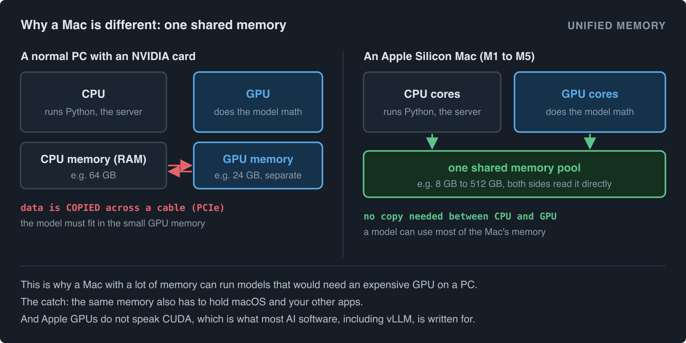

So why not just run vLLM on a Mac? Because vLLM was written for NVIDIA. Its fast parts are CUDA kernels, and a Mac GPU cannot run CUDA. PyTorch does have a Mac mode (called MPS), but it is slower on Apple Silicon than MLX, Apple's own library.

vllm-metal solves this by keeping all the parts of vLLM that do not care about the GPU, and replacing the parts that do.

## The big picture: who does what

It helps to think of the system as a small team where each member has one job.

**vLLM is the manager.** It runs the web server that apps talk to, turns text into tokens, and decides every step which requests get to run and how many tokens each one gets. It also keeps track of which pieces of memory belong to which request. vllm-metal uses this part of vLLM as it is.

**vllm-metal is the plugin, and this project.** It tells vLLM "you are on a Mac", provides the worker that actually runs the model each step, and owns the most delicate part: attention over memory that is shared by many requests. It brings its own GPU kernels, written in Metal, for that.

**mlx_lm is the recipe book.** It knows how each model family is put together, and how to load its weights. It has no idea about servers, requests or shared memory. It just runs a model.

**MLX and Metal are the engine room.** Every bit of math finally runs on the Mac GPU through MLX, in unified memory.

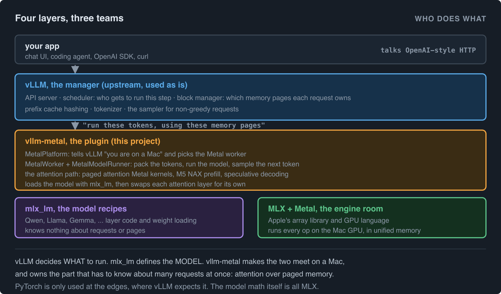

The project's own summary of this is: *upstream vLLM schedules, mlx_lm defines the model, vllm-metal owns the attention path.*

One detail surprises most people. vllm-metal tells PyTorch that the device is `"cpu"` (`vllm_metal/platform.py`, around line 98). That is on purpose. PyTorch is only used at the edges, where vLLM's code expects PyTorch objects, like the sampler. The actual model math never touches PyTorch. It is all MLX.

## Try it yourself

You need an Apple Silicon Mac with macOS 15 (Sequoia) or later.

**Install the stable release with Homebrew:**

```bash
brew tap vllm-project/vllm-metal https://github.com/vllm-project/vllm-metal
brew install vllm-project/vllm-metal/vllm-metal
```

Or, for the latest development build:

```bash
curl -fsSL https://raw.githubusercontent.com/vllm-project/vllm-metal/main/install.sh | bash
source ~/.venv-vllm-metal/bin/activate
```

The install script puts everything in `~/.venv-vllm-metal`. You need to run the `source` line again in every new terminal window. Note that `pip install vllm-metal` is not supported.

**Start a server with a small model:**

```bash
vllm serve Qwen/Qwen3-0.6B
```

The first run downloads the model from Hugging Face. Qwen3-0.6B is small enough for any Apple Silicon Mac, including an 8 GB one. When the log says the server is running, it is listening on port 8000.

**Ask it something, from a second terminal:**

```bash
curl http://localhost:8000/v1/chat/completions \
  -H "Content-Type: application/json" \
  -d '{"model": "Qwen/Qwen3-0.6B", "messages": [{"role": "user", "content": "What is the capital of France?"}]}'
```

The server speaks the same API as OpenAI, so any app or library that works with OpenAI can point at `http://localhost:8000/v1` instead.

For bigger models, look for `mlx-community` versions on Hugging Face, for example `mlx-community/Meta-Llama-3.1-8B-Instruct-4bit`. The `4bit` means the weights were squeezed to 4 bits each, which makes the model about four times smaller than the 16 bit original, so it fits in far less memory.

## Two phases of every answer

Before looking inside, you need one idea about how any LLM writes an answer. It happens in two phases.

**Prefill** is reading. The whole prompt goes through the model in one pass. This is heavy math, and it decides how long you wait before the first word appears. That wait is called the **time to first token**.

**Decode** is writing. The model produces one new token per pass, again and again, until the answer is done. Each pass has to read the whole model from memory to make just one token, so memory speed matters most here. Its speed is measured in **tokens per second**.

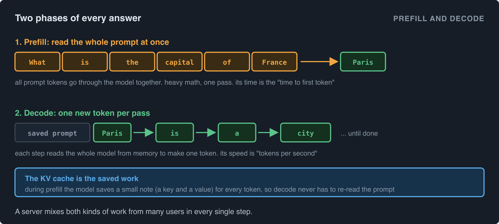

During prefill the model saves a small note for every token it reads: a **key** and a **value**. These notes are the **KV cache**. During decode, each new token only needs to look at those saved notes, so the model never re-reads the prompt. A server is always doing both kinds of work for different users in the same step.

## The KV cache, kept in pages

The KV cache is the biggest thing in memory after the model itself, and how it is stored decides how many users fit at once.

The simple way would be to reserve one big chunk of memory per request, big enough for the longest possible answer. That wastes most of it, because most answers are short. vLLM's famous idea, called **PagedAttention**, works like pages in an operating system. Memory is cut into small **blocks**, and in vllm-metal each block holds 16 tokens. A request gets a new block only when its last one fills up. Its blocks do not have to sit next to each other. A small list called the **block table** records which blocks a request owns, in order.

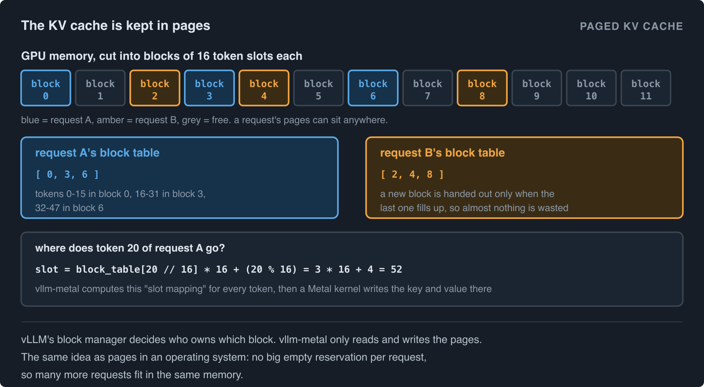

To find where a token's key and value go, vllm-metal computes a **slot** for it:

```
slot = block_table[position // 16] * 16 + (position % 16)
```

This is exactly the formula in `vllm_metal/attention/context.py` (around line 238), as `block_idx * block_size + (pos % block_size)`.

The split of work matters here. vLLM's **block manager** decides who owns which block. vllm-metal never decides that. It only reads and writes the pages it is told to use.

## The life of one request

Now we can follow a request all the way through. This loop runs once per **step**, and every step moves every running request forward by some tokens.

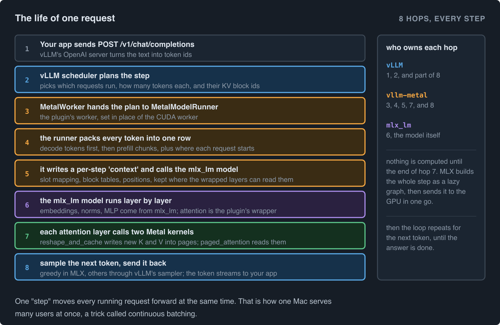

1. **Your app sends a request.** vLLM's OpenAI server turns the text into token ids.
2. **The vLLM scheduler plans the step.** It decides which requests run now, how many tokens each gets, and which KV blocks they use. It hands this plan, called a `SchedulerOutput`, to the worker.
3. **The Metal worker takes over.** When vllm-metal registered itself, it told vLLM to use `MetalWorker` (`vllm_metal/v1/worker.py`) in place of the normal CUDA worker. The worker passes the plan to `MetalModelRunner` (`vllm_metal/v1/model_runner.py`).
4. **The runner packs the tokens.** Every scheduled token from every request goes into one long row: decode tokens first, then prefill chunks. More on why in a moment.
5. **It writes a "context" for the step.** For every token it computes the slot mapping, and for every request its block table, its position and its length. It stores all this where the attention layers can find it, then calls the model.
6. **The mlx_lm model runs.** Embeddings, normalisation and the feed-forward layers are plain mlx_lm code.
7. **Attention runs through vllm-metal's kernels.** In each attention layer, one Metal kernel writes the new keys and values into their pages (`reshape_and_cache`), and another computes attention by reading the pages (`paged_attention`).
8. **The next token is picked and sent back.** For greedy requests (always take the most likely token) this happens in MLX. Other requests go through vLLM's own sampler. The token streams back to your app, and the loop starts again.

One more thing that makes it fast: MLX is **lazy**. Steps 5 to 7 do not compute anything right away. MLX builds a plan of all the math for the whole step, then sends it to the GPU in one go. Nothing waits in between layers.

Because one step moves every running request forward at the same time, one Mac can serve many users at once. This is called **continuous batching**, and it comes free from vLLM's scheduler.

## How it plugs into a model without editing it

Here is a puzzle. mlx_lm models are written for one user at a time, with a simple cache that just grows. They know nothing about pages, block tables, or other users. How does vllm-metal make them work with a paged, shared KV cache, without changing a single line of the model files?

It swaps out the attention part of each layer after loading.

When the KV cache is set up, vllm-metal walks through the model's layers, finds each attention module (named things like `self_attn` or `linear_attn`), and replaces it with its own wrapper. This happens in `walk_and_wrap` in `vllm_metal/attention/patching.py`. The wrapper keeps the original module inside it, so it can still use the model's own weights for turning tokens into queries, keys and values. Only the part that stores and reads the cache is new.

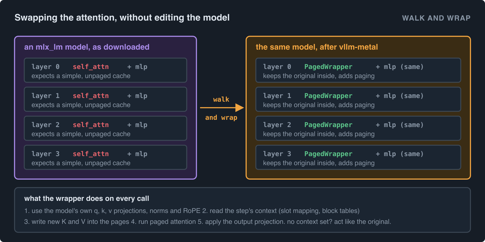

But how does the wrapper get the block tables and slot mapping, when mlx_lm calls it with its normal arguments? This is the clever bit. The runner puts that step's context in a **thread-local** variable, a kind of shared note that anything running on the same thread can read (`vllm_metal/attention/context.py`). The wrapper reads the note. mlx_lm is also handed a fake, empty cache object called `OffsetCache`, which stores nothing and only exists so mlx_lm's own position code keeps working.

If no context is set, the wrapper simply behaves like the original. That keeps the model usable on its own.

## One kernel for the whole batch

In one step, some requests are writing (one new token each) and some are reading prompts (many tokens each). The obvious way would be to run them separately. vllm-metal does not. It packs everything into one row and runs **one attention kernel per layer for the whole batch**.

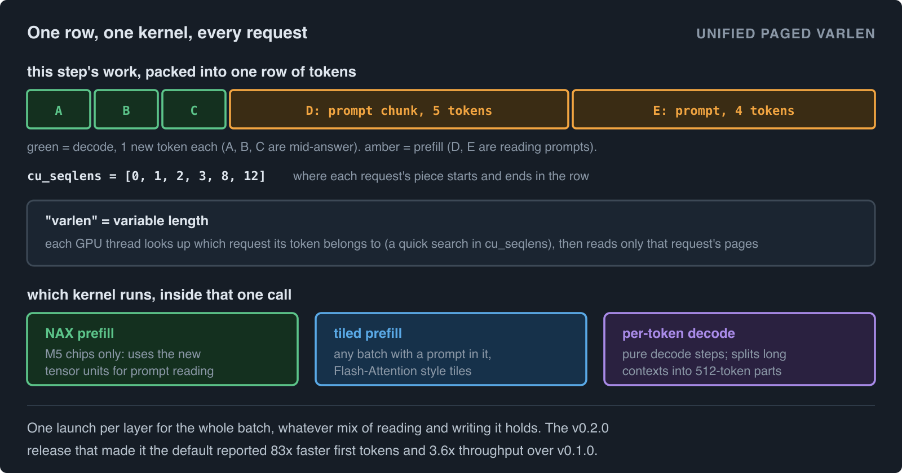

To keep the requests apart inside that one row, the runner builds a list called `cu_seqlens` ("cumulative sequence lengths") that says where each request's piece starts and ends. Every GPU thread takes a token, does a quick search in that list to find which request it belongs to (the `find_seq_idx` function in `pagedattention.metal`), and then reads only that request's pages. Because each request can have a different number of tokens, this is called **varlen**, short for variable length. The same trick is used by FlashAttention and by vLLM's Triton kernels on NVIDIA.

Inside that one call, the plugin picks the best kernel for the job:

- **NAX prefill** on M5 chips. The M5 GPU has new tensor units, and vllm-metal uses them to read prompts faster. This needs macOS 26.2 or later.
- **Tiled prefill** on other chips, whenever the batch contains a prompt. It works in tiles, like FlashAttention.
- **Per-token decode** when every request is just writing. For long conversations with few users, it splits the history into 512-token parts and works on them in parallel.

The project says the v0.2.0 release, which made this unified kernel the default, gave 83 times faster time to first token and 3.6 times higher throughput than v0.1.0.

The kernels live in `vllm_metal/metal/kernels_v2/`. They ship precompiled in the release, so you do not need Xcode to use vllm-metal. Kernel developers can set `VLLM_METAL_BUILD_FROM_SOURCE=1` to compile them locally.

## How much memory the KV cache gets

On a Mac, the model, the KV cache, macOS and your other apps all share one pool of memory. So vllm-metal has to be careful about how much it takes.

macOS tells each program how much memory the GPU should comfortably use, called the **recommended working set**. It is usually around two thirds to three quarters of the Mac's total memory. vllm-metal takes your `--gpu-memory-utilization` fraction of that, then subtracts:

- the **model weights**, which are already loaded, and
- a measured **overhead** for scratch space.

What is left becomes the KV cache, cut into 16-token blocks.

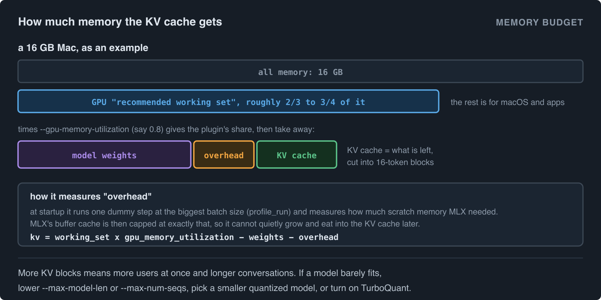

The overhead is measured, not guessed. At startup, vllm-metal runs one dummy step at the largest batch size it may see (`profile_run` in `model_runner.py`) and checks how much extra memory MLX needed. It then caps MLX's internal buffer cache at exactly that amount, so the cache cannot quietly grow later and eat into the KV cache. The budget calculation is in `vllm_metal/v1/cache_policy.py`.

More KV blocks means more users at the same time and longer conversations. If a model only just fits, you can lower `--max-model-len` (the longest conversation) or `--max-num-seqs` (the most users at once), pick a smaller or more quantized model, or turn on TurboQuant (see below).

## Not every model is built the same

Most LLMs use the same basic attention, and those just work. But newer models mix in other kinds of layers, and each needs its own handling. You do not need to understand these to use vllm-metal, but you will see the names in the supported models list.

| Kind | What is different | Examples |
|---|---|---|
| **Standard attention** (MHA, GQA, MQA) | The normal kind. GQA and MQA just share keys and values between several query heads, which shrinks the KV cache. | Qwen3, Llama 3, Mistral, Phi |
| **Sliding window** | Some layers only look at the last few thousand tokens, so old blocks can be freed. | Gemma 3, Gemma 4, OLMo 3 |
| **Hybrid** | Some layers are attention, others keep a small fixed-size "state" instead of a growing cache, like a running summary. The names for those layers are GDN, Mamba-2 and ShortConv. | Qwen3.5 to 3.8, Qwen3-Next, LFM2, Nemotron-H, Granite 4.0 |
| **MLA** | Stores a compressed version of the keys and values, making the cache much smaller. | MiniCPM3, the DeepSeek and GLM family |
| **Sink attention** | Adds a few always-visible "sink" slots to attention. | GPT-OSS |

For hybrid models, vllm-metal keeps the attention layers in pages as usual and stores the running state of the other layers in a separate cache that vLLM also manages. The code for each family is under `vllm_metal/attention/runtime/families/`.

The full list, with a working example checkpoint for each, is in the project's [supported models page](https://github.com/vllm-project/vllm-metal/blob/main/docs/supported_models.md). Many are marked experimental. It is a good idea to check that page before choosing a model.

## Features that make it faster

### Prefix caching

Chat apps send the whole conversation again with every new message. So most of each new request is text the server has already read. **Prefix caching** notices this. vLLM gives each full block of tokens a fingerprint (a hash). When a new request starts with blocks it has seen before, it reuses them and only computes the new part.

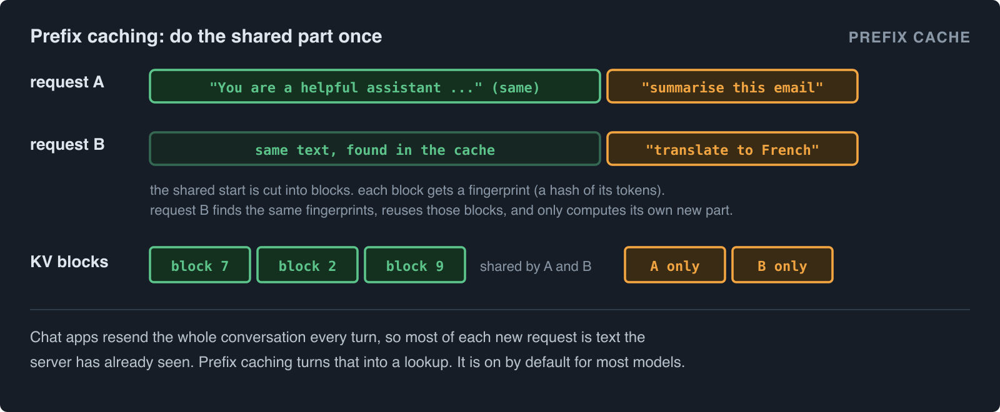

For standard models this is done almost entirely by vLLM. vllm-metal just starts reading the prompt from the first new token, and its kernel reads the reused blocks through the block table as normal. It is on by default for most models. It is currently off for Nemotron-H and Granite 4.0 hybrids.

### Speculative decoding

Decode is slow because the big model makes one token per pass. **Speculative decoding** uses a cheap helper, called a drafter, to guess the next few tokens. The big model then checks all the guesses in one pass, keeps the ones it agrees with, and fixes the first wrong one. The output is exactly what the big model would have written on its own, just faster.

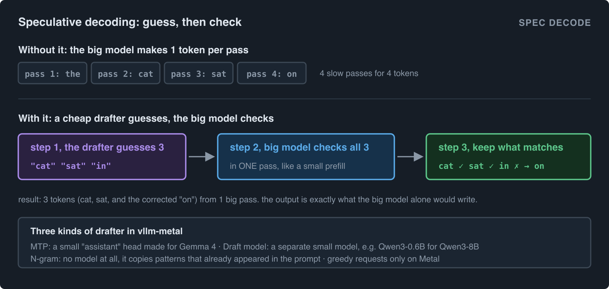

vllm-metal supports three kinds of drafter:

- **MTP**, for Gemma 4 only. A small matching "assistant" model that reads the big model's own KV cache.
- **Draft model**, a separate small model with the same vocabulary, for example Qwen3-0.6B helping Qwen3-8B.
- **N-gram**, which needs no model at all. It looks for the same pattern earlier in the text and guesses that it repeats. Great for code edits and summaries that copy from the prompt.

On Metal, only greedy requests (temperature 0) are drafted, and you must add `--no-async-scheduling`. Example:

```bash
vllm serve Qwen/Qwen3-8B --max-model-len 2048 --no-async-scheduling \
  --speculative-config '{"method":"ngram","num_speculative_tokens":3,"prompt_lookup_min":2,"prompt_lookup_max":3}'
```

### Decode pipeline

Between two decode steps, the CPU has to prepare the next step. Normally the GPU sits idle while that happens. With the decode pipeline, which is on by default, vllm-metal starts building step 2 while the GPU is still busy with step 1. It feeds step 1's token into step 2 without waiting for it to arrive back on the CPU. This only works for plain greedy decode, and only when vLLM's async scheduling is on. The result is exactly the same text, with less idle time.

### TurboQuant

The KV cache is normally stored with 16 bits per number. **TurboQuant** shrinks it. It first "spins" the numbers with a Walsh-Hadamard rotation so that no single number is extreme, then stores small blocks of them with fewer bits. The default keeps keys at 8 bits and values at 3 bits, which makes the cache about 2.5 times smaller. The same memory then holds about 2.5 times more conversation.

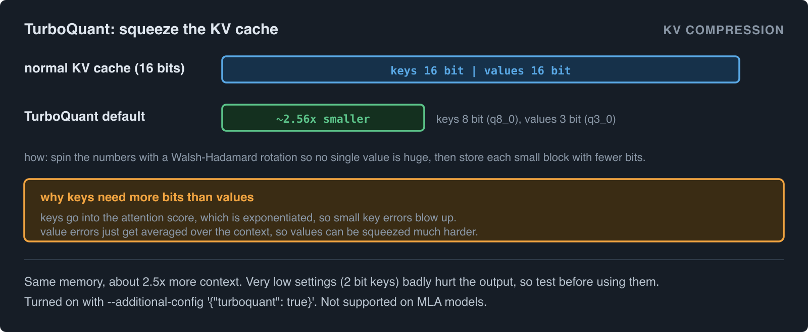

Keys need more bits than values because keys feed into the attention score, which goes through an exponent, so small errors in keys get blown up. Errors in values are just averaged. Very low settings, like 2 bit keys, clearly damage the output, so test before using them.

```bash
vllm serve meta-llama/Llama-3.2-1B-Instruct --dtype bfloat16 --max-model-len 32768 \
  --additional-config '{"turboquant": true, "k_quant": "q8_0", "v_quant": "q3_0"}'
```

It does not work with MLA models, and head size must be 64, 128 or 256.

### Smaller things

- **Compiled MLP** (`VLLM_METAL_COMPILED_MLP=1`, off by default): fuses many small operations in the feed-forward layers into fewer GPU calls during decode. It currently targets Qwen3-Next and Qwen3.5 models.
- **Native sampling** (`VLLM_METAL_NATIVE_SAMPLING=1`, off by default): does temperature, top-k and top-p sampling inside MLX, skipping the trip to PyTorch.
- **M5 NAX prefill**: automatic on M5 chips, as described above. `VLLM_METAL_DISABLE_NAX=1` turns it off if something goes wrong.

## More than chat

vllm-metal can do more than chat models, though most of these are marked experimental.

- **Images.** Qwen3-VL, Qwen3.5, PaddleOCR-VL and Gemma 4 can read images (no video yet).
- **Speech to text.** Whisper and Qwen3-ASR, through the same OpenAI-style API. Install with `pip install 'vllm-metal[stt]'`.
- **Embeddings and rerankers.** Qwen3-Embedding, Qwen3-Reranker, BGE-M3 and multilingual E5, for search and RAG.
- **GGUF files**, the format used by llama.cpp and Ollama, for dense Qwen, Llama and Mistral models with Q8_0, Q4_0 or Q4_1 weights. Install with `pip install 'vllm-metal[gguf]'`. The weights stay compressed.
- **AWQ** 4-bit checkpoints for Qwen2.5, Llama 3 and Mistral.
- **LoRA adapters**, small add-on weights that customise a model.

## Using more than one Mac

For normal use, one Mac is all you need. But if you have two or more, there are two ways to use them together. Both use a tool called Ray to start one worker on each Mac.

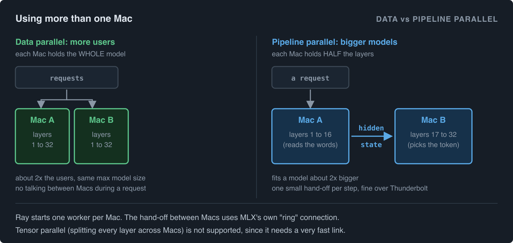

**Data parallel** puts a full copy of the model on each Mac, and spreads requests between them. You serve about twice as many users, but the biggest model you can run does not change, because each Mac still has to hold all of it.

**Pipeline parallel** splits the model's layers. The first Mac runs the first half of the layers and sends its result to the second Mac, which runs the rest and picks the token. Now you can run a model about twice as big. Only one small hand-off happens between the Macs per step, which is fine even over a Thunderbolt cable. That hand-off uses MLX's own connection, called the "ring". The project checked that the output is bit-for-bit identical to running on one machine.

**Tensor parallel**, which splits every single layer across machines, is not supported. It needs to talk between machines inside every layer, which needs a much faster link.

The details, including how to connect two Macs over Thunderbolt, are in the project's [distributed guide](https://github.com/vllm-project/vllm-metal/blob/main/docs/distributed.md).

## Settings cheat sheet

Normal vLLM flags that matter most on a Mac:

| Flag | What it does |
|---|---|
| `--gpu-memory-utilization 0.8` | How much of the GPU's recommended memory vllm-metal may use. |
| `--max-model-len 8192` | The longest conversation, in tokens. Lower it to save memory. |
| `--max-num-seqs 8` | The most requests running at once. |
| `--no-async-scheduling` | Needed for speculative decoding and pipeline parallel. |
| `--additional-config '{"turboquant": true}'` | Turns on KV cache compression. |

vllm-metal's own environment variables (the full list is in the [configuration docs](https://github.com/vllm-project/vllm-metal/blob/main/docs/configuration.md)):

| Variable | Default | What it does |
|---|---|---|
| `VLLM_METAL_DECODE_PIPELINE` | `1` | Overlap the next decode step with the current one. |
| `VLLM_METAL_COMPILED_MLP` | `0` | Fuse feed-forward work during decode. |
| `VLLM_METAL_NATIVE_SAMPLING` | `0` | Do non-greedy sampling in MLX. |
| `VLLM_METAL_DISABLE_NAX` | `0` | Turn off the M5 tensor unit path. |
| `VLLM_METAL_MULTIMODAL_MODE` | `auto` | How image models are served. `text-only` forces text only. |
| `VLLM_METAL_BUILD_FROM_SOURCE` | `0` | Compile the Metal kernels locally, for kernel developers. |

## What it cannot do yet

vllm-metal fails loudly at startup when you ask for something it does not support, which is much better than silently doing the wrong thing. The main gaps today:

- **Tensor parallel** (splitting layers across machines).
- **`logit_bias` and `min_tokens`** in requests.
- **Speculative decoding for non-greedy requests.** They simply run without drafts.
- **Quantized KV cache through `--kv-cache-dtype`.** Use TurboQuant instead.
- **Some mixes of features.** For example pipeline parallel with GGUF, AWQ, hybrid or image models, and data parallel with mixture-of-experts models.
- **Video and audio input** for multimodal models.
- **Sliding window attention** works but is "not fully optimized", in the project's words.

It also pins exact versions of MLX (`0.32.1`) and mlx_lm. That is because the Metal kernels plug directly into MLX's internals. Upgrading MLX on your own will likely break it, so let the installer manage versions.

## Where to find things in the code

If you want to read the source, here is a map. Paths are inside [`vllm_metal/`](https://github.com/vllm-project/vllm-metal/tree/main/vllm_metal).

| What | Where |
|---|---|
| How vLLM finds the plugin | `pyproject.toml` (entry point `vllm.platform_plugins`) and `__init__.py` |
| Telling vLLM "this is a Mac", checking settings | `platform.py` (`MetalPlatform`) |
| The worker and the model runner | `v1/worker.py`, `v1/model_runner.py` |
| Loading the model with mlx_lm | `v1/model_lifecycle.py`, `v1/model_adapter.py` |
| KV cache memory budget | `v1/cache_policy.py` |
| The per-step context and slot mapping | `attention/context.py` |
| Swapping attention layers | `attention/patching.py` |
| The attention wrapper and its forward pass | `attention/impls/sdpa_wrapper.py`, `attention/impls/sdpa.py` |
| Hybrid model families | `attention/runtime/families/` |
| Metal kernels | `metal/kernels_v2/*.metal` |
| C++ glue between MLX and the kernels | `metal/paged_ops.cpp` |
| Sharing memory between PyTorch and MLX | `pytorch_backend/tensor_bridge.py` |
| Sampling | `v1/sampling_batch.py` |
| Speculative decoding | `v1/spec_decode.py`, `v1/draft_model_proposer.py`, `v1/ngram_proposer.py`, `v1/gemma4_mtp.py` |
| Decode pipeline | `v1/decode_pipeline.py` |
| Pipeline parallel over the MLX ring | `distributed/pipeline.py` |
| Fixes for version mismatches in vLLM and others | `compat.py` |

## The short version

vllm-metal keeps everything in vLLM that is about managing requests, and replaces everything that touches the GPU. It loads models with mlx_lm, swaps each attention layer for a wrapper that understands vLLM's paged KV cache, and runs one custom Metal kernel per layer for the whole batch. The result is a real vLLM server, with the same API, the same scheduler and the same features like prefix caching and speculative decoding, running on the unified memory of a Mac.

---

*Figures are in [`images/`](images/), numbered in the order they appear. Their editable SVG sources are in [`images/src/`](images/src/). To re-render one after editing: `rsvg-convert -w 1600 images/src/NN-name.svg -o images/NN-name.png` (install with `brew install librsvg`).*
